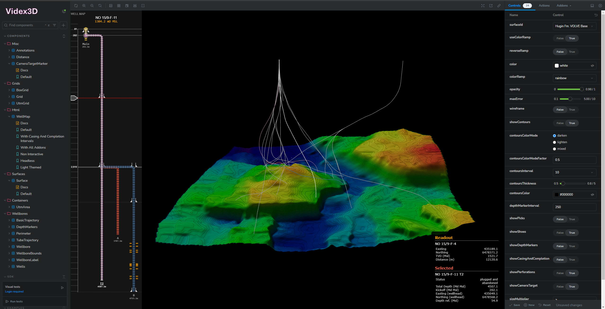

[](https://scm-compliance-api.radix.equinor.com/repos/equinor/videx-wellog/badge)

# Introduction
The purpose of this library is to help you add 3D visualizations of sub surface data to your web applications. It offers a paradigm for connecting data to React components, utilizing Three js and React Three Fiber.



The library includes a variety of components, both for visualizing and managing data, including:
- Wellbore trajectories
- Wellbore data (such as casings, completion tools, picks, shoes etc.)
- Horizons/surfaces
- Generic support for pointer events (click, move, enter, exit)
- A flexible point-feature label system
- HTML well map schematic

## Overview
This library contains multiple exports:
- `videx-3d` main export containing the components
- `videx-3d/sdk` shared code and declarations
- `videx-3d/generators` generator functions required by the included components

### Dependencies
This library has dependencies to the following libs:
- React and react-dom
- THREE js (javascript 3d rendering library using WebGL)
- React Three Fiber (bridge React and THREE js)
- Comlink (simplifies working with web workers)

## Install
```
npm i videx-3d
```

You also need to install the peer-dependicies:
```
// react
npm i react react-dom

// three js
npm i three

// react three fiber
npm i @react-three/fiber

// comlink
npm i comlink
```


## Configure
Rendering complex scenes in the browser (single threaded) can quickly become bottlenecked, degrading user experience. For this reason, most of the components have been decoupled from data management and processing, by depending on a _store interface_ and _generator_ functions. This allows the heavy work to be offloaded to web workers (but not required).

The recommended setup is to run the data store implementation and generator registry in seperate web workers, and then pass a proxy for these instances to the respective providers. You need to use [Comlink](https://github.com/GoogleChromeLabs/comlink) for this to work.

For example, assuming you have created a class `DataStore` (implementing the `Store` interface) you can _expose_ an instance of this class so that it can be run in isolation by a web worker:

```ts
// set up worker endpoint: remote-store.ts
import { expose } from 'comlink'
import { MyStore } from './DataStore'

const store = new DataStore()

expose(store)
```

Then we do the same exercise for the `GeneratorRegistry`:

```ts
// set up registry endpoint: remote-registry.ts
const registry = new GeneratorRegistry()

// add all the ganerators you need
registry.add('generatorName', generatorFunction)

expose(registry)
```

We then need to create the workers and point them to the scripts we exposed using Comlink. Using the `wrap` function will do this for us and return a proxy class instance that we can pass to the respective providers:

```tsx
import { DataProvider, Store } from 'videx3d/sdk'
import { Remote, wrap } from 'comlink'

const store: Remote<Store> = wrap(new Worker(new URL('workers/remote-store.ts', import.meta.url), { type: 'module'}))

const registry: Remote<Store> = wrap(new Worker(new URL('workers/remote-registry.ts', import.meta.url), { type: 'module'}))

const ExampleApp = () => (
  <>
    { ... }
    <DataProvider store={store}>
      <RegistryProvider registry={registry}>
        { ... }   
      </RegistryProvider>
    </DataProvider>
    { ... }
  <>
)
```
If instead you want to run the data store and/or registry on the main thread, simply create and pass an instance directly to the provider.

For more information see the API docs.

## Documentation
- [Getting Started](https://equinor.github.io/videx-3d/docs/documents/getting-started.html)
- [Storybooks](https://equinor.github.io/videx-3d/)
- [API docs](https://equinor.github.io/videx-3d/docs)
