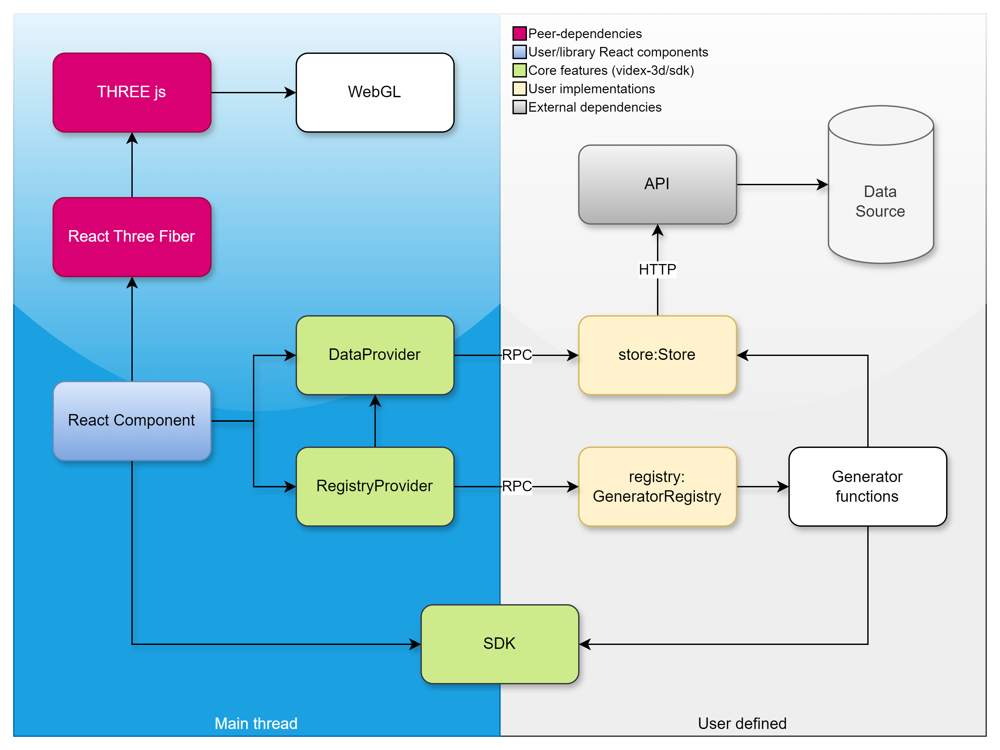

# Architecture
The diagram below illustrates the dependency chain of this library. It is devided into two boundaries, where everything in the blue half is running on the main thread and where the remaining parts may be externalized and executed as separate scripts using web workers if desired. 

The cross-boundary communication is then handled by Comlink through Proxy classes and remote procedure calls.

 

There are two essential React context provider components, which link data and factory methods to other components:

- DataProvider
- GeneratorsProvider

### DataProvider

Provides a data store from which generators or components can access data. The data provider expects an implementation of a store adhering to the `Store` interface:

```ts
type KeyType = string | number

interface Store {
  get: <T>(dataType: string, key: KeyType) => Promise<T | null>
  set: <T>(dataType: string, key: KeyType, value: T) => Promise<boolean>
  all: <T>(dataType: string) => Promise<T[] | null>
  query: <T>(dataType: string, queryString: string) => Promise<T[]>
}
```

Data needs to be organized as named _data sets_ indexed by a key, which may be either a string or a number (typically the id of a data record).

As an example, consider a data set named 'wellbore-headers'. You would then retrieve a wellbore header record from the store by invoking the async `get` function:

```ts
const header = await store.get(
  'wellbore-headers',
  'abcd-1234-efgh-5678-ijkl-9000'
)
```

Specify types are declared for common data types used throughout this library. These are defined in `/src/sdk/data/types` and can be imported from `videx-3d/sdk`.

Some examples:
- WellboreHeader
- PositionLog
- Casing
- CompletionTool
- Pick
- StratColumn

**NOTE:** It is important that your source data is mapped properly to these types! All depth data are typically in meters and referenced by MSL (mean sea level).

### GeneratorsProvider

Provides a factory for processing/generating data required in the render loop. This is typically geometry data which it builds based on simple arguments passed by a component depeneding on the generator (such as an id, radius, scale and other option values). The generator code will typically access the store itself to retrieve the data it needs from the data provider.

The components available in this library already have generator functions created that expects certain data sets to be accessable from the store. These can be imported from `videx-3d/generators`.

Generator functions are registered in the `GeneratorRegistry` by adding them to the instance along with a key:

See: [generators](generators.md)

```ts
const registry = new GeneratorRegistry()

registry.add('generator name', myGeneratorFunction)
```

Generators are typically dependant on the data context, and the `GeneratorsProvider` must therfore be added as a child of the `DataProvider`:

```tsx
<...>
<DataProvider store={store}>
  <GeneratorsProvider registry={registry}>
    {/* Add any components depending on data/generators here */}
  </GeneratorsProvider>
</DataProvider>
</...>
```

Where `store` is an implementation of the `Store` interface and `registry` is an instance of the `GeneratorRegistry` class.

As with data set names, existing components depends on generators available in the registry with specific key names. For example, the `BasicTrajectory` component will depend on a generator named `'basicTrajectory'`. These names are declared and exported with the components, and you will find which dependencies each component have in the api docs.

### SDK
The SDK (software development kit) contains supporting functions and classes, which can be imported from `videx-3d/sdk`. This contains data type definitions, utility functions and other shared code, which may be used across boundaries. 

