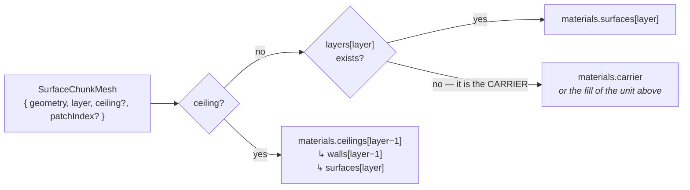

# Appearance

Materials, procedural detail, inference marking — and who owns what.

- [The material channels](#the-material-channels)
- [Which mesh gets which material](#which-mesh-gets-which-material)
- [ChunkMaterial](#chunkmaterial)
- [Procedural detail](#procedural-detail)
- [Marking the inference](#marking-the-inference)
- [Water tint](#water-tint)
- [Opacity, peel and transparency](#opacity-peel-and-transparency)
- [Pointer events](#pointer-events)
- [Ownership rules](#ownership-rules)

---

## The material channels

Every appearance decision is per **layer**, and there are two slots because a
boundary has two sides worth painting:

```ts
type ChunkLayer = {
  // …
  material?: string;                                // the CAP colour
  fill?: string | boolean | null;                   // the VOLUME BELOW
  detail?: ChunkDetail;                             // procedural relief on both
  opacity?: number;                                 // overrides the chunk sliders
  contacts?: string[] | false;                      // which contacts draw here
  section?: boolean;                                // false = keep this unit whole
};
```

- `fill: true` means *"the same as my own cap"* — the common case for a zone whose
  wall should read as the unit hanging below its top surface.
- Omitting `fill` (or `null` / `false`) means **no volume at all**.
- Both slots take a **colour** (`string`); `ChunkMeshes` builds and **owns** the
  material. A caller cannot supply its own `Material` — the shipped `ChunkMaterial`
  is what carries the section cut, fence cut, water tint, contacts, procedural
  detail and OIT variants, none of which an outside material could take part in.

Colours never reach the build spec, so **recolouring cannot rebuild geometry**.
There is no `colors` array and no `topMaterial` prop either.

> ⭐ **Opacity belongs to the unit, not to the chunk.** Water at 0.45 over an
> opaque sea bed is one chunk, not two. `ChunkLayer.opacity` is an **override**,
> not a multiplier, so it wins outright — which also means the chunk-level
> `surfaceOpacity` / `wallOpacity` sliders no longer reach that layer. Leave it
> unset on the layers a global transparency control should sweep.

---

## Which mesh gets which material

Both mesh lists are **sparse** — a dropped layer contributes no cap, an unfilled
interval no wall — so position cannot be used. Every `SurfaceChunkMesh` carries its
`layer` index, which indexes the **caller's** `layers` array.



Five material families are built:

| Family | For | Notes |
|--------|-----|-------|
| `surfaces[i]` | caps | layer 0 also carries the water tint |
| `walls[i]` | interval walls and cut faces | built with `wall: true`, so bedding is anchored to the unit |
| `ceilings[i]` | a void's **upper** copy | a cap drawn with the *interval above*'s fill; needs its own instance because a cap has no `wallV` attribute |
| `faces[i]` | cut faces | same colour as the wall, but **never cut** |
| `carrier` | the column's floor | from `ChunkStack.carrier.material`, else the fill of the unit resting on it |

Plus `patches` — the fragments a cap gave up to a layer above, restored when that
cover is gone. See
[cutting-and-water.md](./cutting-and-water.md#restoring-what-the-collapse-dropped).

Two rules that look odd out of context:

- **A ceiling and a carrier both face UP**, so what they show is the *base of the
  unit above* rather than a cap of their own — hence the `layer − 1` lookup. The
  exception is a carrier given an explicit `material`, which is the one case where
  the floor reads as its own thing (a datum rather than the underside of the
  deepest unit).
- **A cut face must not carry the cut it exists to close.** A fence's face lies
  exactly on the curve while the shader tests the field's *interpolated* zero
  crossing — metres out against an offset of centimetres — so testing it punches
  holes along its whole length. A plane's test is exact either side, but the face
  still has to sit **proud** of the block, and proud means on the removed side of
  its own test.

---

## ChunkMaterial

`ChunkMaterial extends ShaderMaterial`, built from `ShaderLib.phong` uniforms with
`shaders/chunk-vert.glsl` and `chunk-frag.glsl`, and it calls `attachOitVariants`
in its constructor — so it is OIT-ready without the caller doing anything.

Blinn-Phong rather than `MeshStandardMaterial`, because a `ShaderMaterial` needs to
own its shader anyway and Phong is the cheaper base.

### Parameters

```ts
type ChunkMaterialParameters = {
  color?, opacity?, transparent?, depthWrite?, wireframe?, side?   // stock
  specular?, shininess?                                            // Blinn-Phong
  ambient?: Vec2 | false;              // orientation-dependent ambient
  detail?: ChunkDetail;                // procedural relief
  wall?: boolean;                      // anchor detail to the unit, not to depth
  waterTint?: ChunkWaterTintParameters;
  sectionPlane?: IUniform<Vector4>;    // the shared plane uniform
  fence?: ChunkFenceUniforms;          // the shared fence uniforms
  contacts?: ChunkContactTexture[];
};
```

### Defines

Every feature is `#define`-gated, and the defines are read **at construction** — so
changing one needs a **new material**, which is exactly what `ChunkMeshes`'
appearance memo produces (a fresh identity also makes the OIT pass re-classify).

`CHUNK_AMBIENT`, `CHUNK_DETAIL` (+ `CHUNK_DETAIL_GRANULAR`, `CHUNK_DETAIL_GRAIN`,
`CHUNK_DETAIL_DUNES`), `CHUNK_WALL`, `CHUNK_WATER_TINT`, `CHUNK_BATHYMETRY`,
`CHUNK_SECTION`, `CHUNK_FENCE`, `CHUNK_CONTACTS` (whose value is the count).

### Ambient, and why it is there

Three routes `scene.environment` to `MeshStandardMaterial` / `MeshPhysicalMaterial`
**only**, so a `ShaderMaterial` gets no image-based lighting and looks flat and
muted next to a standard material. `CHUNK_AMBIENT` compensates by multiplying
`irradiance` by `mix(ground, sky, worldNormal.y * 0.5 + 0.5)` — default
`DEFAULT_CHUNK_AMBIENT = [1.35, 0.5]` — using the **perturbed** normal. It
redistributes the flat ambient rather than adding energy, so relief reads on unlit
faces without an environment map's colour bleed.

### The OIT cost guard

```glsl
#if defined(OIT_DEPTH_PASS) || defined(OIT_OCCLUSION_PASS)
  // …early out right after diffuseColor
#endif
```

Those two passes write only depth, or need only alpha, so all the procedural detail
and contact work is skipped in half the passes. Measured: 57 fps with detail on
versus 59 off. **Any library material with procedural detail should copy this
guard.**

---

## Procedural detail

`ChunkLayer.detail` adds texture-free surface relief once the camera is close. Off
by default.

```tsx
{ surface: m, fill: true, detail: 'sand' }
{ surface: m, fill: true, detail: { preset: 'shale', strength: 0.6 } }
```

Presets, matching the sediment classes a host is likely to have:
`sand`, `silt`, `shale`, `carbonate`, `salt`, `coal`, `basement`, `seabed`.

Each preset is a `ChunkDetailParams`:

| Field | Meaning |
|-------|---------|
| `granular` | isotropic bumps — `strength`, `frequency` (**cells per metre**), `octaves`, `anisotropy` |
| `grain` | directional ridges — `strength`, `frequency`, `angle`, `sharpness`, `uniformity`, `octaves`, `bedding` (0..1, unit-relative on walls), `laminae` |
| `dunes` | large meandering ridges — `strength`, `wavelength` (m), `direction` |
| `albedo` | colour modulation, 0..1 |
| `height` | bump scale (perceived slope ≈ `strength × height`) |

The public surface is deliberately just *preset name + one strength*, so the look
stays consistent between layers and between fields.

### The pattern coordinate

> ⭐ **The pattern coordinate is the WORLD position**, projected onto the cardinal
> plane the face most nearly lies in — XZ for a cap, ZY or XY for a wall — **not**
> the geometry `uv`.

Two reasons. A cap has no `uv` of its own (its position is a shared `xz` plus a
per-layer `y`), and a wall's is *metric* (arc length / world Y); neither is a pattern
space.
And world anchoring means a feature keeps its size wherever it is drawn, so a cap
and its wall are continuous across the edge and the per-surface repeat/scale problem
disappears. On walls, `grain.bedding` mixes unit-relative `wallV` with world Y so
beds stay unit-relative rather than absolute.

### Two calibration lessons

- **The scale is deliberately exaggerated.** Realistic feature sizes are unusable at
  field scale: a metre spans roughly `1000 / distance` pixels and a cell needs
  ~2.5 px, so a 0.5 m cell dies at ~200 m while a 10 m cell survives to ~4 km.
  Presets therefore span a *band*, from a 5–20 m coarse octave down to ~0.5–1 m.
- **Filtering is per octave, and gradients are analytic.** A whole-pattern footprint
  fade kills the layer as soon as its *finest* octave is under-sampled, so the fade
  is applied per octave. And screen-space gradient bump (`perturbNormalHeight`)
  makes detail **swim** as the camera moves; the fix is analytic derivatives
  (`pnValueNoise2Grad` → `pnFbmSigned2FilteredGrad` → `pnGranularFilteredGrad`),
  tilting the world normal with `N − (slope.x·planeU + slope.y·planeV)`.

See [../procedural-normal.md](../procedural-normal.md).

---

## Marking the inference

Where the seal invented geometry (see [model.md](./model.md#sealing)), the shader
gets a per-vertex `inferred` weight — the taper's own blend weight, so it fades
exactly as the invention does — on both caps and walls.

`Chunk.inferredStyle` decides how it is shown:
`'none' | 'hatched' (default) | 'checker' | 'zigzag'`.

> ⭐ **Every style is a PATTERN, never a colour.** A recoloured region says
> something ended without saying what, and worse, it is indistinguishable from a
> unit that simply has a different colour — the one reading that must not be
> possible. A pattern cannot be mistaken for data.

It is drawn as an **overlay mesh** sharing the unit's geometry, rather than as part
of the unit's material. Consequences:

- One overlay material per distinct **(opacity, cut)** pair, built lazily. Opacity,
  because a translucent unit must not be marked opaquely. Cut, because the overlay
  is a second mesh with its own material — a kept unit whose marking was still cut
  would lose its hatching at the plane while the rock stayed.
- Suppressed in wireframe, where an overlay is only noise.
- A **cut face's** overlay is never cut, for the same reason the face's own
  material is not: it lies on the cut, so testing it would hatch nothing at all.

`InferenceMaterialOptions`: `spacing` (pattern period in **metres**, world-anchored,
default 40), `width`, `strength`, `opacity`, plus the shared `sectionPlane` /
`fence` uniforms.

The corresponding numbers are on
`SurfaceChunkLayerDiagnostics.inferred` (`1 − coverage`, footprint-relative) and
`.filled`.

---

## Water tint

`ChunkWaterTint` on `StackWater` tints whatever lies **under** the sea, as if seen
through the water column — the chunk's answer to the `Ocean` component's
`seaBedWaterTint`.

| Field | Default | Meaning |
|-------|---------|---------|
| `bedTint` | follows `waterOpacity` | strength deep down, 0..1 |
| `bedTintDepth` | `DEFAULT_BED_TINT_DEPTH` = 80 m | depth at which the tint reaches ~86% of `bedTint` |
| `wetBand` | 0 (off) | depth of the darker wet band just below the waterline |
| `wetStrength` | 0.4 | how much `wetBand` darkens the ground |

It is **depth-dependent** where the `Ocean`'s is flat, because a chunk's sea bed is
ordinary geology and can rise **through** the water (a coast, an island). Absorption
that fades to nothing at the waterline leaves land untinted without anything having
to know where the shoreline runs — and stays right as the level is swept.

The depth is read from the **bed's own grid** (`CHUNK_BATHYMETRY`, supplied by
`useStackBathymetry`) rather than from each fragment's height, so the gradient
follows the bathymetry rather than the tessellation; where that grid is unmapped it
falls back to the fragment's own depth.

Applied to the cap of the **shallowest** layer only: it stands for looking down
through the water at the bed, not for making the whole column blue.

> ⚠️⚠️ The depth varying uses **object** space (`waterTintParams.x − transformed.y`),
> **not** `vWorldPosition.y` — the stack may carry a vertical exaggeration, which
> would rescale a world-space depth away from metres. Chunk meshes carry no Y
> translation, so object Y *is* the stack's metre frame.

---

## Opacity, peel and transparency

Semi-transparent stacks need an `OITRenderPass` base pass to be ordered correctly.
Two things follow from the ordinary alpha model that are worth stating:

- **Alpha compounds.** A deep stack at 0.5 is effectively opaque, so a transparency
  slider cannot answer *"what is underneath?"*.
- **`peel` can.** It hides the first `peel` **units** — each unit's cap *and* its
  volume — keeping the cap of the first survivor, which is that unit's own top, so
  the block stays closed by construction. It is exact and free (pure appearance).

`peel` is a **count**, not a per-layer flag, deliberately: the `layers` array *is*
the depth order, so removing a **prefix** is exact, whereas an arbitrary set can
open the block.

> ⚠️ Peeling down to a horizon a *neighbouring* chunk draws under the seam rule
> leaves this block open at the top. `Chunk` warns about it rather than letting it
> present as a rendering artefact.

`ChunkMaterial` is `DoubleSide`. Note the disagreement with `Surface`, which is
double-sided when opaque and front-only when transparent (a non-OIT
self-transparency mitigation) — under OIT, `SurfaceMaterial` forces `DoubleSide` on
its pass variants anyway. See
[../oit-guide.md](../oit-guide.md).

---

## Pointer events

`Chunk` takes the standard `PointerEvents` props and registers its **own meshes**
with the `EventEmitter` — a `<group ref>` wrapping only `<ChunkMeshes>`, so
`children` stay out of the hit surface.

Every mesh is tagged:

```ts
userData={{ layer, kind: 'surface' | 'wall' | 'section' }}
```

Without it a hit only says *"this chunk"*. With it,
`event.source.userData.layer` says **which unit** was hit.
`EventEmitterCallbackEvent.position` is the world hit position (the pick buffer
stores `vec4(vEmitterId, vWorldPosition)`), and `event.button` distinguishes a
right-click from a left one.

> ⚠️ A cursor or marker rendered **inside** the picked group becomes an emitter and
> picks itself. Keep it outside (or use `LAYERS.NOT_EMITTER`).
>
> ⚠️ Markers drawn over a transparent stack are painted over by the transparent
> passes. `LAYERS.OVERLAY` is drawn last by `OITRenderPass`, leaving depth testing
> to the material.

---

## Ownership rules

1. **Every material is built from a colour → owned here → disposed here.** A caller
   cannot supply its own `Material`, so nothing is passed through undisposed.
2. **Materials are rebuilt on appearance change**, with a fresh identity, so the
   OIT pass re-classifies them.
3. **Never attach the same property by two mechanisms** on one JSX element. Walls
   always use the `material` **prop** (single or array); caps always use the keyed
   `<primitive attach="material">` form. Mixing them across a branch makes React
   reuse the mesh and R3F reset the removed prop to a fresh `Mesh`'s default — a
   white `MeshBasicMaterial`, which OIT then dutifully draws as opaque white.
4. **`ChunkMeshes` owns no geometry**, except the small patch geometries (which
   share the cap's attribute buffers, so they go with the chunk).
