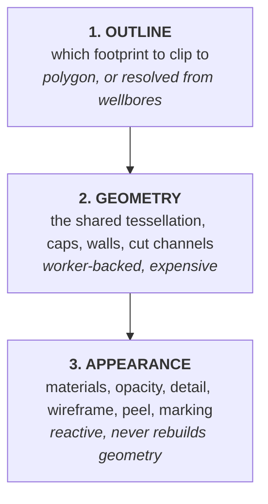
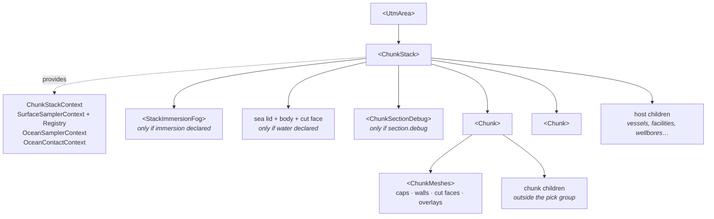

# Architecture

The component tree, what each context carries, and the rule that decides whether a
change repaints or rebuilds.

- [The three reactive layers](#the-three-reactive-layers)
- [Component tree](#component-tree)
- [What ChunkStack provides](#what-chunkstack-provides)
- [Stable identities and content keys](#stable-identities-and-content-keys)
- [What rebuilds what](#what-rebuilds-what)
- [Ownership and disposal](#ownership-and-disposal)

---

## The three reactive layers

This is the load-bearing decision of the whole feature. Three concerns are kept
strictly apart so that cheap changes stay cheap:



| Layer | Lives in | Changes when | Cost |
|-------|----------|--------------|------|
| 1. Outline | `Chunk` (`source`, `wellboreOutline`) | the outline prop, the cut source, the wellbore data, or the depth window changes | one async resolve; possibly real I/O |
| 2. Geometry | the `surfaceChunk` generator, in a worker | surfaces, fills, outline, `resolve`, `rimSpacing`, `maxError`, seams, or the *presence* of a section/fence/peel changes | seconds at field scale |
| 3. Appearance | `ChunkMeshes` | materials, colours, opacity, `detail`, `wireframe`, `peel` value, `inferredStyle`, contacts, water tint | material rebuild only |

The consequences show up all over the API and are worth stating explicitly:

- **Materials never reach the build spec.** `buildSurfaceChunkSpec` deliberately
  drops `material`, `fill`'s colour, `detail` and `opacity`. Colour used to be a
  build parameter baked into geometry, and recolouring rebuilt the block.
- **Toggles are free, presence is not.** `section.enabled`, `fence.enabled` and the
  *value* of `peel` are appearance. But the **presence** of `section`, `fence` or
  the `peel` prop asks the build for extra payload (cut channels, peel indices), so
  adding or removing the prop *does* rebuild. This is why the props are read as
  `!!stack.section` rather than `stack.section?.enabled`.
- **Anything driven per frame bypasses React entirely.** The section plane, the
  fence field and the sea's uniforms are shared mutable objects written once per
  frame from `useFrame`. Moving a section plane costs no render and no material
  rebuild.

---

## Component tree



Everything renders inside one identity-transform `<group ref={stackFrame}>`. It
exists so that anything driven from the **camera** — the locked section plane, the
immersion test, the fence's auto side — has a frame to be brought into. It is the
one place where world space and the stack's own space differ, because a stack may
carry a vertical exaggeration (`scale={[1, k, 1]}`).

### Responsibilities

**`ChunkStack`** owns everything that cannot belong to one chunk:

- the column and its envelope
- the carrier plane
- the sea (a lid covers its whole footprint by design, so two chunks each drawing
  part of it would leave two coplanar lids wherever their footprints overlap)
- the cut — one plane or one fence for the whole block
- the registries: which chunk claims which surface, which chunk draws a shared
  horizon, each chunk's build state and wellbore margin
- release of the cached column on unmount

**`Chunk`** owns one block:

- resolving its outline (layer 1)
- assembling a serialisable spec and driving the generator (layer 2)
- registering claims, publishing its outline, reading back seams
- disposing the geometry it built, and registering it for sampling
- pointer events over its own meshes

**`ChunkMeshes`** owns nothing but materials:

- resolves each layer's cap/fill/ceiling/carrier/face material
- builds the inference overlays
- builds the cut faces per frame from the chunk's channels
- lays out the meshes, tagging each with `userData.layer` and `userData.kind`

---

## What ChunkStack provides

`ChunkStackContextValue` (`ChunkContext.ts`) carries three quite different kinds of
thing, and the distinction is deliberate:

### Build inputs — changing these rebuilds chunks

`outline`, `cutSource`, `surfaces`, `column`, `envelope`, `carrier`, `resolve`,
`rimSpacing`, `maxError`, `outlines`, `seams`, `margins`.

### Appearance — reaches `ChunkMeshes` without joining a spec

`carrierMaterial`, `contacts`, `water`, `bathymetry`.

`carrierMaterial` is published **separately** from `carrier` for exactly this
reason: the carrier's identity is keyed on *where the plane is*, so recolouring the
floor cannot rebuild the geometry.

### Live, per-frame state — read outside React

`section` (`ChunkSectionState`), `sectionUniform`, `sectionUniformInverse`,
`sectionCarrier`, `fence` (`ChunkFenceState`), `fenceUniforms`,
`fenceUniformsInverse`, `fenceCarrier`.

`ChunkSectionState` and `ChunkFenceState` are **stable objects the stack mutates**.
The caller naturally writes `section={{ plane, enabled }}`, which is a new object
every render, and this context's identity is what every chunk's build spec derives
from — so publishing the prop itself would rebuild every chunk on any parent
render. Nothing in them is read during React rendering.

> ⭐ `sectionUniform` is one `IUniform<Vector4>` handed to **every** material of
> every chunk, the sea and the overlays. A `ShaderMaterial`'s OIT variants share
> their `uniforms` object by reference, so a single write per frame reaches every
> material in all four OIT passes.
>
> `sectionUniformInverse` is its exact complement, for geometry that must appear
> *only* where the section took something away (the peel patch — see
> [cutting-and-water.md](./cutting-and-water.md#restoring-what-the-collapse-dropped)).
> Negating the disabled value `(0,0,0,-1)` yields `(0,0,0,1)`, which draws nothing
> — exactly right when nothing has been cut away.

### Callbacks

`registerChunk`, `releaseChunk`, `publishOutline`, `publishMargin`,
`reportBuildState`. See [coordination.md](./coordination.md).

### The two sampler contexts

Deliberately **separate** from `ChunkStackContext`:

| Context | Direction | Why separate |
|---------|-----------|--------------|
| `SurfaceSamplerRegistryContext` | chunks **publish** their built geometry | a sibling finishing its geometry must not disturb the value every chunk's build spec is derived from |
| `SurfaceSamplerContext` | consumers **read** the sampler | a new identity is the signal to re-sample |

`OceanSamplerContext` and `OceanContactContext` are provided too, so a floating
child heaves with the swell and spreads foam exactly as it would inside an
`<Ocean>` — with nothing extra wired.

---

## Stable identities and content keys

`layers={[...]}` is the natural JSX idiom and makes a **new array every render**.
The build must not key on that identity. Every such input is therefore reduced to a
**content key** and re-memoised:

```ts
// Chunk.tsx — the BUILD key: surfaces and which intervals are filled
type ChunkLayerKeyRole = {
  build?: (l: ChunkLayer) => string;       // keys the GEOMETRY (rebuilds the chunk)
  appearance?: (l: ChunkLayer) => string;  // keys the MATERIALS (re-runs ChunkMeshes)
};

// One role per ChunkLayer field, in ONE place. `fill` has both: its presence is
// geometry, its colour is appearance. `relief` is serialised whole (a union of
// shapes; a field-by-field list goes stale the moment the union grows).
const CHUNK_LAYER_KEY = {
  surface: { build: l => l.surface?.id ?? '' },
  depth: { build: l => `${l.depth ?? ''}` },
  offset: { build: l => `${l.offset ?? ''}` },
  relief: { build: l => (l.relief ? JSON.stringify(l.relief) : '') },
  fill: { build: l => (chunkLayerFill(l) ? '1' : '0'), appearance: l => appearanceId(l.fill) },
  material: { appearance: l => appearanceId(l.material) },
  detail: { appearance: l => chunkDetailKey(l.detail) },
  opacity: { appearance: l => `${l.opacity ?? ''}` },
  section: { appearance: l => (l.section === false ? '0' : '1') },
  contacts: { appearance: l => (l.contacts === false ? 'none' : (l.contacts?.join('+') ?? '')) },
} satisfies Record<keyof ChunkLayer, ChunkLayerKeyRole>;

const layersKey = chunkLayersBuildKey(layers);          // → stableLayers
const appearanceKey = chunkLayersAppearanceKey(layers); // → appearanceLayers
```

> ⭐ **The keys are DERIVED from one classification.** `satisfies Record<keyof
> ChunkLayer, …>` makes TypeScript error the moment a field is added without a
> `build` / `appearance` role — so "forget to key it" becomes a **compile** error
> rather than the silent runtime bug it shipped as twice (most recently `contacts`,
> which was in neither key). Forget a build role and toggling the field does
> nothing; forget an appearance role and its value freezes at the last build.

The same idiom appears on `ChunkStack` for `carrier`, `water`, `resolve` and
`contacts`. Two of them are worth calling out:

- **`water` has two keys.** `waterKey` (the whole object) drives the *materials*;
  `waterBuildKey` (`depth` / `resolution` / `displacement` only) drives the
  *geometry spec*. Everything else on `StackWater` is sea state, and keying the
  spec on the whole object made every wind/foam/opacity tick rebuild the lid in the
  worker.
- **`contacts` keys the surface by `id` only.** A grid cannot change under a stable
  id.

`resolve` deserves a note of its own: those options **are** the shared column's
cache key, and the cache holds exactly one entry. A chunk (or the sea) asking with
a different identity rebuilds the whole column. Declare `resolve` on the
**stack**, memoised, and let chunks inherit it.

---

## What rebuilds what

| Change | Outline | Geometry | Materials | Per-frame only |
|--------|:-------:|:--------:|:---------:|:--------------:|
| `layers` array identity, same content | — | — | — | — |
| add/remove a surface, or flip a `fill` | — | ● | ● | — |
| `material` / `fill` colour / `opacity` / `detail` | — | — | ● | — |
| `wireframe`, `showSurfaces`, `showWalls` | — | — | ●¹ | — |
| `peel` **value** | — | — | — | ● |
| `peel` **prop added or removed** | — | ● | ● | — |
| `inferredStyle` | — | — | overlays only | — |
| `outline` / `cutSource` / wellbore options | ● | ● | ● | — |
| `resolve` object identity | — | ● (whole column) | ● | — |
| `section.plane` mutated, `section.enabled` | — | — | — | ● |
| `section` prop added or removed | — | ● | ● | — |
| `fence.wellbore`, `fence.side` | — | — | —² | ● |
| `fence` prop added or removed | — | ● | ● | — |
| `fence.debug` | — | — | ● | — |
| `ChunkStack.contacts` | — | — | ● | — |
| `ChunkStack.water` sea state | — | — | ●³ | — |
| `ChunkStack.water.depth` / `.resolution` / `.displacement` | — | sea only | ● | — |
| a sibling chunk's outline settling | — | ●⁴ | ● | — |

¹ `wireframe` is a material property here, so it rebuilds materials, not geometry.
² a `side` flip swaps a texture and a curve; both sides are built up front.
³ ocean uniforms are updated per frame; the *materials* are keyed on `waterKey`.
⁴ only if it changes a seam decision this chunk takes part in.

### Two React-specific notes

- **A rebuilt chunk forces one extra render.** React double-buffers its fibers, and
  the `alternate` retains the previous render's hook state — here an entire
  replaced chunk, hundreds of MB, disposed and unreachable but pinned for the life
  of the component. `Chunk` bumps a dummy state after a build lands so the
  alternate holds the *current* chunk instead. Nothing is rebuilt: geometry and
  materials are memoised.
- **The inference overlay builders are module-scope functions.** V8 gives a
  function scope one `Context` holding every variable captured by any closure
  inside it, so closures defined in the component body pinned that render's whole
  `chunk` until the appearance happened to change. Passing the inputs as arguments
  keeps the captured scope to exactly those parameters.

---

## Ownership and disposal

| Thing | Created by | Disposed by |
|-------|-----------|-------------|
| chunk geometries (caps, walls) | the generator, unpacked in `Chunk` | `Chunk`, in a `[chunk]` cleanup effect |
| patch geometries (peel/section) | `ChunkMeshes` | `ChunkMeshes` — ⚠️ they share the cap's attribute buffers |
| cut-face geometries | `useChunkSection` / `useChunkFenceFace` | the same hooks |
| chunk materials (caps, walls, faces) | `ChunkMeshes` | `ChunkMeshes` (`materials.owned`) |
| inference overlays | `ChunkMeshes` | `ChunkMeshes` (`overlays.built`) |
| sea lid / body geometry | `ChunkStack` | `ChunkStack` |
| ocean materials | `useStackWater` | `useStackWater` |
| contact / bathymetry textures | `useChunkContacts` / `useStackBathymetry` | the same hooks |
| **the cached column** | the generator scope | `releaseStackResources`, called by `ChunkStack` on unmount |

Two traps worth remembering:

> ⚠️ **The shared buffers.** `buildStackGeometries` shares one `xz`
> `BufferAttribute` (the plan positions) AND one index `BufferAttribute` across the
> layers — duplicating either would cost more than all the per-layer height data.
> So a stack's layers must be disposed **together**, and the worker transfer list
> must be deduped (`packSurfaceChunk` returns the same `ArrayBuffer` several times).

> ⚠️ **Never attach the same property by two mechanisms.** Walls always use the
> `material` **prop** (single or array), never a `<primitive attach="material">`
> child. React reuses a `<mesh>` of the same type and key across a branch switch, so
> removing the prop makes R3F reset it to a fresh `Mesh`'s default — a white
> `MeshBasicMaterial`, which OIT then faithfully draws as opaque white. Caps use the
> keyed `<primitive attach>` form, which has no array case.

The column is by far the largest allocation the library makes — one `Float32Array`
channel per layer over the whole reference grid, plus masks, truncation masks and
seal weights. It is keyed to the *column*, not to a component, so nothing collects
it until it is released. `SurfaceChunkDiagnostics.columnBytes` reports it, and
`chunkResourceStats()` reports what the built chunks hold.
