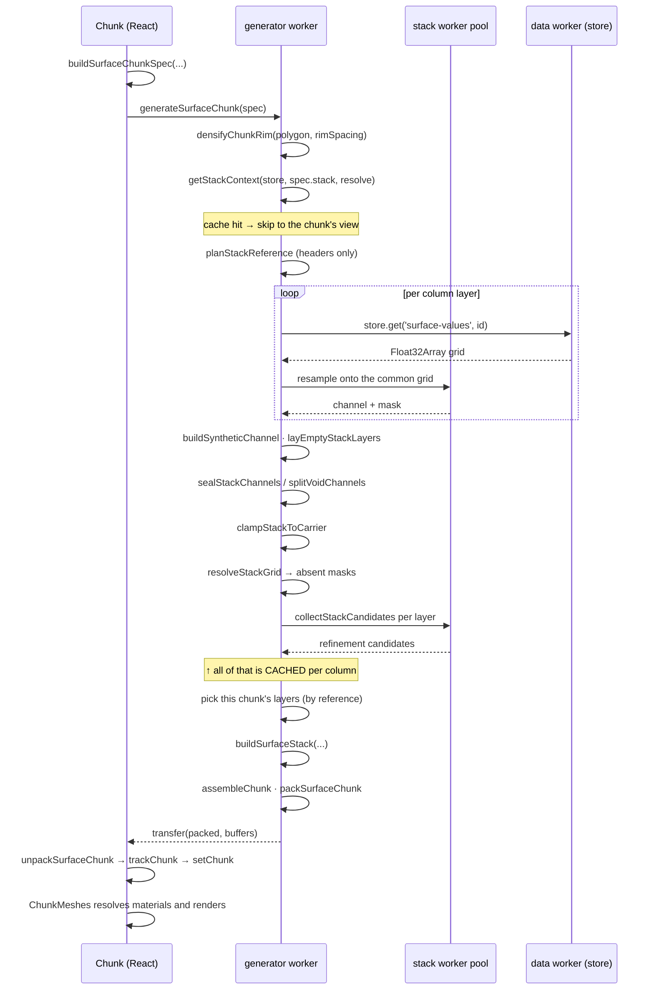
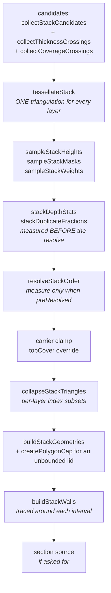

# The build pipeline

From `<Chunk layers={...} />` to triangles. Every stage, in order, with the
function that runs it and what it scales with.

- [Overview](#overview)
- [Stage 1 — the spec (main thread)](#stage-1--the-spec-main-thread)
- [Stage 2 — the shared column (worker)](#stage-2--the-shared-column-worker)
- [The shared column cache](#the-shared-column-cache)
- [Stage 3 — the chunk's own view](#stage-3--the-chunks-own-view)
- [Stage 4 — buildSurfaceStack](#stage-4--buildsurfacestack)
- [Stage 5 — assemble, pack, transfer](#stage-5--assemble-pack-transfer)
- [Stage 6 — back on the main thread](#stage-6--back-on-the-main-thread)
- [The worker pool](#the-worker-pool)
- [Superseded builds](#superseded-builds)
- [Invariants worth knowing](#invariants-worth-knowing)

---

## Overview



The two boxed regions are the whole story of the cost model:

- Everything down to the candidates scales with **reference grid nodes × layers**
  and is paid **once per column**.
- `buildSurfaceStack` onward scales with **shared tessellation vertices × layers**
  and is paid **per chunk**. At field scale, this second group dominates.

See [sampling-and-perf.md](./sampling-and-perf.md#the-cost-model).

---

## Stage 1 — the spec (main thread)

`buildSurfaceChunkSpec(layers, utmToArea, outlinePolygon, options)` →
`SurfaceChunkSpec`.

Pure, synchronous, and deliberately tiny. It produces **plain data only**: no
class instances, no `Material`, no `Float32Array` grids. `PlanarPolygonGeometry` is
flattened to `{ coordinates, offset }` and reconstructed in the worker.

What it does:

1. Maps each layer to a spec layer — either
   `{ id, header, referenceDepth, worldPosition }` (from `SurfaceMeta`) or
   `{ depth, offset, relief }` (synthetic), plus `fill`, `cap` and `capCuts` from
   the seam decision.
2. **Infers the carrier layer**: if the stack declares a `carrier` and the *last*
   layer has a `fill`, a `{ carrier: true, fill: false }` layer is appended.
3. Collects the neighbours' footprints referenced by `capCuts` into `cuts`, each
   carrying **its owner's `rimSpacing`** — densifying it differently would put the
   two boundaries on different points of the reference grid and the seam would open
   a hairline crack.
4. Builds the column spec via `stackColumnSpec`, whose `key` is
   `orderedSurfaceIds | carrierDepth/carrierBelow`.

> ⚠️⚠️ **Everything built from the same column must derive that key here.** The
> cache holds exactly one entry, so two callers asking for the same column under
> different names evict each other and pay for the fetch, the resample and the
> resolve twice. This is why `buildStackWaterSpec` calls `stackColumnSpec` too.

The spec is memoised on its inputs, and the build **token** rides outside it
(`{ ...spec, build: { key, token: ++n } }`) on purpose: the token changes on every
request, and putting it in the memo would churn it.

---

## Stage 2 — the shared column (worker)

`getStackContext(store, stack, resolve)` in
`src/generators/surface-stack-context.ts`. On a cache miss it runs
`buildStackContext`:

| # | Step | Function | Notes |
|---|------|----------|-------|
| 1 | Plan the common grid | `planStackReference` | headers only — no grids fetched yet |
| 2 | Fetch + resample, pipelined | `store.get` → `resampleStackChannel` | each layer is resampled as soon as its own grid lands, on the pool |
| 3 | Synthetic channels | `buildSyntheticChannel` | `depth` / `offset` / `relief` |
| 4 | Empty layers | `layEmptyStackLayers` | see the sentinel trap below |
| 5 | Carrier level | `stackCarrierLevel` | `{below}` is measured from the deepest **mapped** sample |
| 6 | Seal | `sealStackChannels` or `splitVoidChannels` | once, for the whole column |
| 7 | Clamp to the carrier | `clampStackToCarrier` | elementwise `max`, order-preserving |
| 8 | Depth order | `resolveStackGrid` | elementwise `min` cascade → per-node `absent` masks |
| 9 | Clamp again | `clampStackToCarrier` | a positive `minGap` could otherwise push the floor below what it just truncated |
| 10 | Refine | `getStackCandidates` → pool → `collectStackCandidates` | cached alongside the column |

### The common grid

`planStackReference` picks the **finest** layer's grid (smallest `xinc × yinc`) so
no layer is resampled *up*, crops it to the envelope, and decimates by an integer
`step` if the crop exceeds `maxNodes` (`DEFAULT_STACK_MAX_NODES` = 4,000,000).
Every layer is then bilinearly resampled onto it, expressed in **scene Y**
(`y = value − referenceDepth`).

`StackReference`:

```ts
{
  header: SurfaceClipHeader;   // nx, ny, xinc, yinc, rot of the common grid
  worldPosition: Vec2;         // scene XZ of node (0,0)
  channels: Float32Array[];    // per layer: scene Y at every node
  masks: Uint8Array[];         // per layer: coverage
  step: number;                // source cells per reference cell
}
```

Masks are **tri-state**, and every consumer tests them for truthiness so the
distinction costs nothing downstream:

| Constant | Value | Meaning |
|----------|-------|---------|
| `STACK_MASK_NONE` | 0 | no extent here |
| `STACK_MASK_DATA` | 1 | real data from the layer's own grid |
| `STACK_MASK_FILLED` | 2 | no data of its own, but within `maxFill` metres of some — counted as covered, reported as fill |

Holes and past-the-edge regions are filled from the nearest real sample with a
two-sweep chamfer transform (`chamferFill`), so the grid has no cliffs for the
triangulator to chase. **Values are always filled; what `maxFill` bounds is the
MASK.** See [outlines.md](./outlines.md#bounded-fill).

> ⚠️ **The `-1e30` pillar.** `STACK_NO_DATA` is the channel sentinel. A layer with
> data *nowhere* has nothing to fill from, so its channel would keep the sentinel
> and produce a surface at Y = −1e30 — a wall reaching to infinity. `layEmptyStackLayers`
> copies such a layer's channel from its nearest mapped neighbour (zero thickness,
> so the collapse drops it) while leaving its **mask** empty so the diagnostics
> stay truthful. Any caller can hit this with a survey that misses the footprint
> entirely.

### What is cached

`StackContext` holds, per column:

| Field | Space | Meaning |
|-------|-------|---------|
| `reference` | expanded | channels + masks over the common grid |
| `layers` | column | the fetched `StackLayer`s |
| `index` | column | surface id → layer index |
| `expansion` | column → expanded | 1 entry normally, 2 where a void split a layer |
| `ceiling` | expanded | is this the upper copy of a void |
| `carrier` | **column** | index of the carrier layer, or null |
| `absent` | expanded | per-node truncation masks from `resolveStackGrid` |
| `inferred` | expanded | per-node seal weights, or null when unsealed |
| `tapered` | column | node counts the seal moved |
| `pairs` | expanded | per-adjacent-pair crossing statistics |
| `bytes`, `retainedBytes`, `fetchMs`, `referenceMs`, `sealMs`, `resolveMs` | | accounting |

> ⚠️⚠️ **Column space and expanded space coincide until something splits.** Under
> `sealMode: 'proportional'` nothing splits, so an index mistake here passes every
> test and only breaks under `'void'`. Two such slips have shipped. When touching
> this code, check which space each array is in — the table above is the reference.

---

## The shared column cache

- **One entry.** The channels are the heaviest thing the library holds — nodes ×
  layers × 4 bytes, hundreds of MB at field scale — so a second entry is not
  affordable.
- **Key** = `stack.key` (ordered surface ids + carrier) `|` `resolve.mode` `|`
  `minGap` `|` `maxNodes` `|` `maxFill` `|` *resolve present* `|` `seal` `|`
  `sealMode` `|` `minThickness`.
- **Hit** → the cached promise is returned; concurrent chunks await the same
  in-flight promise.
- **Miss** → a new build is chained after the current one (column builds are
  serialised) and becomes the cached entry, evicting the old.
- **Released** by the `stackRelease` generator (`releaseStackResources`), which
  `ChunkStack` invokes on unmount — through a ref, so a change of callback identity
  cannot throw the column away mid-session.

`generatorStats()` reports `columnKey`, `columnBytes`, `candidateBytes`,
`columnsBuilt`, `columnsInFlight`, `poolSize` and (in Chrome) the V8 heap.

---

## Stage 3 — the chunk's own view

With a column, the chunk does **not** copy anything. It picks its layers out of the
column by index and takes the channels **by reference**:

```
column layers  :  [ 0  1  2  3  4  5  6 ]        ← ChunkStack.surfaces (claimed)
expansion      :  [[0][1][2,3][4][5][6][7]]      ← a void split layer 2
chunk picks    :        2  3  4                  ← this chunk's surfaces
                        ↓
built layers   :  [ ceiling(2) floor(2) 3 4 carrier ]
source[]       :  [    2         2      3 4   5    ]  ← back to the CALLER's layers
```

Assembled in **one loop** pushing to all seven parallel arrays together —
`channels`, `masks`, `source`, `ceilings`, `inferred`, `candidates`, `preResolved`
— deliberately, so they cannot drift. `source[]` is what keeps
`SurfaceChunkMesh.layer` indexing the *caller's* layers, so materials keep
resolving.

Three per-chunk decisions are made here:

- **`chunkCopies`** — which copies of a split layer this chunk draws. A ceiling
  *always* travels with its floor: the collapse drops a ceiling by comparing it
  with its own floor copy, so a chunk given the ceiling alone would draw it over
  the whole footprint and fight the horizon its seam owner draws.
- **`caps` / `capCuts`** — from the seam decision, except that a **void ceiling is
  always capped** by the chunk holding the interval above it: the seam assigns the
  shared *horizon* (the floor copy), while a ceiling exists only inside the void.
- **`fills`** — derived rather than passed down: `fills[k] = !ceiling[k] &&
  loaded[source[k]].fill && !voided`. A ceiling holds no volume, which is what
  makes the void below it a void.

### When `preResolved` cannot be used

The column's per-node `absent` masks are dropped, and the per-vertex resolve runs
instead, when the chunk has a **synthetic layer** (the column never saw it) or when
the column was **sealed**.

> ⭐ The second reason is subtle and was a real defect. The column's masks are
> perfectly valid — they are just decided at **grid nodes**, while a triangle is
> dropped only when **all three of its own corners** are marked. An island of
> marked *vertices* can never remove anything; an island of marked *nodes* spans
> cells and takes whole triangles with it, punching walled notches into the cap.
> Sealing leaves surfaces running a metre apart over wide bands, which is exactly
> what produces those islands.
>
> **A decision taken at grid nodes and one taken at shared vertices are not
> interchangeable.**

---

## Stage 4 — buildSurfaceStack

`buildSurfaceStack(reference, layers, options)` in
`src/sdk/geometries/surface-stack-geometry.ts` is **the** entry point. The
individual steps are exported too, but they must be run in this order and with each
other's outputs — resolving without collapsing, in particular, leaves welded
duplicate surfaces behind, which is the one thing a shared tessellation still
z-fights on.



### Candidates

The height refinement knows each surface only on its own, so it puts no vertices
where two of them converge or where one runs out of data. Two extra passes fix
that, merged into the union:

- `collectThicknessCrossings(above, below, nx, threshold)` — the line where a unit
  wedges out (`refineTerminations`, default on). Majority-voted over the
  4-neighbourhood first, because the raw test speckles where two surfaces run
  nearly parallel a hair apart.
- `collectCoverageCrossings(mask, nx)` — the edge of a layer's own data
  (`refineCoverage`, default on, but **off** when `constrainCoverage` is on).
  Deliberately *without* the vote: a one-node thickness flicker is noise, a
  one-node coverage hole is data.

Coverage refinement is the one a **sealed** stack needs: a sealed surface keeps full
thickness either side of its data edge, so that edge is not a thickness crossing and
nothing else would put vertices on it — the taper would then start wherever the
height refinement happened to leave a vertex, hundreds of metres inside the data.

### tessellateStack

Inputs: the reference, the **densified** polygon, `maxError`, the candidate union,
the neighbours' `cuts`, and `constrainCoverage`.

- Candidates are **inserted** (forced insertions, not a pool), filtered to the
  chunk's footprint dilated by one cell — exact, because the rim is a constraint
  edge and flips never cross one, and un-dilated it drops nodes lying exactly on
  the rim.
- The **rim** is inserted and **constrained**. So are the `cuts` and, when asked,
  each layer's traced mask boundary — as *open chains* that do not extend the kept
  domain.
- Exterior triangles are removed, vertices compacted.
- Per-cut and per-coverage triangle membership is decided by **centroid**, which is
  exact precisely because the ring is constrained.

Returns `StackTessellation`: `coords`, `indices`, `rimVertices`, optional `cuts` /
`coverage` flags, plus `rimDropped`, `coverageRingPoints` and
`constraintFailures` — the last should always be 0.

> ⚠️ **Do not simplify the coverage rings.** Ramer–Douglas–Peucker makes a
> rectilinear traced ring cross *itself* where two staircase arms pass within the
> tolerance, and the noder skips same-ring pairs — so the constraint is silently not
> enforced.

### Collapse: what is dropped, and by which rule

`collapseStackTriangles` produces one index subset per layer. A triangle of layer
`i` is dropped when any of these holds:

| Reason | Test | Granularity |
|--------|------|-------------|
| **excluded** | a neighbouring chunk draws this cap here (`capExcluded`) | per triangle |
| **absent — coverage** | `coverageTriangles[i]` says outside, or **any corner** uncovered | per triangle when constrained, else **per corner (any)** |
| **absent — truncation** | `absent[i]` at **all three** corners | per corner (all) |
| **collapsed** | `above − current ≤ threshold` at **all three** corners | per corner (all) |
| **carrier** | the layer has been flattened onto the carrier | as above |

The asymmetry is not sloppiness. Thickness is the difference of two linear
interpolants over shared topology, so all-three-corners-thin means the whole
triangle is thin — the test is **exact**. Coverage is binary and interpolates
nothing, so *any* uncovered corner drops the triangle, which keeps the drawn area
inside the mapped one.

`stackIntervalTriangles` answers the companion question — where does the interval
below layer `i` exist — and shares `makeAbsentTriangleTest` with the collapse so
the two cannot drift.

> ⭐ The interval rule is `kept(i+1) ∩ present(i)`, **not** `kept(i) ∩ kept(i+1)`.
> A layer dropped for coinciding with `i−1` still bounds a real volume below.

### Walls

`buildStackWalls` traces the boundary of each interval's own triangle set
(`buildEdgeOpposites` + `traceBoundaryRings`) and builds a quad strip per ring.

> ⭐ **An interval's wall is the boundary of the area that interval occupies.** The
> rim is not a special case — it is just the part of that boundary lying on the
> outline. That is what gives terminations a face at all, and it fixed a
> long-standing inconsistency where a wall was drawn along the whole rim even where
> the unit had pinched out.

Adjacency is built **once per tessellation**; each interval then reads two flags
per edge. Re-hashing per layer would be millions of map operations on a deep stack.

Vertex attributes written by `buildRingWalls`:

| Attribute | Meaning |
|-----------|---------|
| `position` | XZ from the ring, Y from the top/bottom heights |
| `normal` | **assigned explicitly**, constant per segment |
| `uv` | u = cumulative arc length (metres), v = world Y — anchored in world space |
| `wallV` | 0 at the base, 1 at the top of the interval |
| `inferred` | the seal's taper weight, when there is one |

Two details that are easy to get wrong:

- **Normals are not computed.** `computeVertexNormals` is area-weighted and gives a
  rim point's top and bottom vertices *different* normals, because they belong to
  different triangle sets. A normal varying vertically as well as horizontally
  interpolates differently in each of a quad's two triangles, producing a seam along
  every quad diagonal. Instead each point gets the normalised average of its two
  adjacent segment normals, given to both its top and bottom vertex.
- **Creases are split.** Past `WALL_SMOOTH_ANGLE` (40°) a ring point emits two
  vertices so each side keeps its own flat normal — otherwise a square crop's
  corners are shaded as if they were round. Within a segment both vertical edges
  still carry one normal, so the anti-diagonal-seam property survives.
- **Ring orientation is derived, not assumed**: the sum of the traced rings' signed
  areas is compared with the widest rim ring's sign and flipped if they disagree. A
  sign error silently inverts every wall normal.

### The unbounded lid

A layer marked `unbounded` (the sea) has its cap built by `createPolygonCap` on
the rim rings, **not** from the shared tessellation. A flat lid in the shared TIN
is wrong in both directions at once: it carries every vertex the surfaces below it
needed, and still has no detail of its own where they did not — which is exactly
where a water surface is most likely to be displaced. Nothing is compared against
it per vertex, so it is free to be tessellated on its own terms; the only thing it
must agree with is the wall below it, and that follows from the shared rim, which
ear clipping never splits.

---

## Stage 5 — assemble, pack, transfer

`assembleChunk(layers, rings, options, timings)` turns the built stack into a
`SurfaceChunk`:

```ts
type SurfaceChunk = {
  surfaces: SurfaceChunkMesh[];   // caps
  walls: SurfaceChunkMesh[];      // interval walls
  section?: StackSectionSource;   // channels for a cut face
  metrics: SurfaceChunkMetrics;   // timings, counts, diagnostics
};

type SurfaceChunkMesh = {
  geometry: BufferGeometry;
  layer: number;          // index into the CALLER's layers
  ceiling?: boolean;      // a void's upper copy, or the carrier
  patchIndex?: Uint32Array; // fragments given up to the layer above
};
```

> ⭐ Both lists are **sparse** — a dropped layer contributes no cap, an unfilled
> interval no wall — so position cannot be used to look up a material. Every mesh
> carries its `layer` index for exactly that reason.

`packSurfaceChunk` then flattens the geometries and returns the transfer list.

> ⚠️⚠️ **The packer must not restate fields.** It uses
> `Omit<SurfaceChunkMesh, 'geometry'> & { geometry: PackedBufferGeometry }` and
> spreads, because TypeScript happily allows excess properties on a *source* object
> — a hand-listed packer silently drops any new field, and the compiler says
> nothing. When adding a field to a type that crosses the worker boundary, **grep
> for the packer.**

The transfer list is **deduped**: `packSurfaceChunk` returns the same shared index
`ArrayBuffer` once per layer.

---

## Stage 6 — back on the main thread

```ts
const response = await generator({ ...spec, build: { key, token: ++buildToken.current } });
const built = response ? unpackSurfaceChunk(response) : null;
if (built) trackChunk(built);
setChunk(built);
if (built) onBuildRef.current?.(built.metrics);
reportState(built ? 'ready' : 'empty');
```

`trackChunk` is called **before** `setChunk`, so the window in which the new chunk
exists and the old one has not been released yet — the rebuild's peak — is visible
in `chunkResourceStats()`.

A `null` response is not an error. It means the chunk has nothing to draw: no
outline, or a footprint cut away entirely. It reports `'empty'`.

---

## The worker pool

`src/generators/workers/stack-worker-pool.ts`.

- Created lazily on first use, once per generator scope. Size
  `max(1, min(hardwareConcurrency − 1, 8))`.
- The worker is imported with Vite's `?worker&inline`, so it ships **base64-encoded
  inside the library bundle** — no host bundler configuration, and it works whether
  the host runs the generator registry on the main thread or in a worker.
- Two task kinds: `'resample'` and `'refine'`.
- If `Worker` is unavailable or construction fails, the pool is `null` and both
  paths fall back to running the SDK function serially (`poolSize: 0` in the
  result).

| Task | Transferred in | Returned |
|------|----------------|----------|
| `resample` | the raw grid `values` (never needed again downstream) | `channel` + `mask` |
| `refine` | a **copy** of the channel (the caller still needs it) | candidate node indices |

> ⚠️⚠️ **The worker bundle must stay free of `three`.** `stack-refine.worker.ts`
> imports only `collectStackCandidates` and `resampleStackLayer`, so
> `surface-stack-candidates.ts`, `surface-stack-resample.ts`, `surface-grid.ts`,
> `chamfer.ts` and `mesh-boundary.ts` must stay three.js-free. Pulling three in here
> embeds a second copy of it in the bundle. Check with `vite build` — `generators.js`
> should stay around 50 kB.

---

## Superseded builds

A slider drag can issue builds faster than the worker completes them. `cancelled`
on the main thread only discards the *result*, after the worker has already paid
for it.

`SurfaceChunkSpec.build = { key, token }` fixes that: `claimGeneratorRun` records
the newest token per key and returns an `isStale()` predicate, checked at the
points where the worker is about to commit to something long (after the column
fetch, and after refinement starts). A superseded run returns `null` at the first
opportunity.

---

## Invariants worth knowing

1. **One tessellation per chunk, shared by every layer.** Monotone vertex heights
   stay monotone under linear interpolation on shared triangles, so interpenetration
   is impossible rather than merely unlikely. (Per-layer TINs are error-bounded
   individually, so two surfaces closer than `2 × maxError` can interpenetrate even
   when the grids never cross.)
2. **The rim is a constraint edge**, in every chunk, at the owner's `rimSpacing`.
   Everything exact about seams and footprint filtering rests on that.
3. **Heights are decided once per column; shapes are decided per chunk.** A shared
   horizon must have one height — that is why the seal moved to the column.
4. **Arrays are aligned by index, and misalignment is silent.** `channels`, `masks`,
   `source`, `ceilings`, `inferred`, `candidates`, `preResolved`, `caps`, `capCuts`,
   `fills` all index the same list. The per-layer `CHUNKREPORT` rows in the stories
   carry name + coverage + triangles precisely so a misalignment shows up at once.
5. **A build flag overridden downstream must be reported as overridden.** The
   diagnostics once reported `capped: entry.cap` — the caller's seam flag — while a
   void ceiling was being drawn with `capped: false, triangles: 0`. `SpecStackResult.caps`
   carries the effective value.
