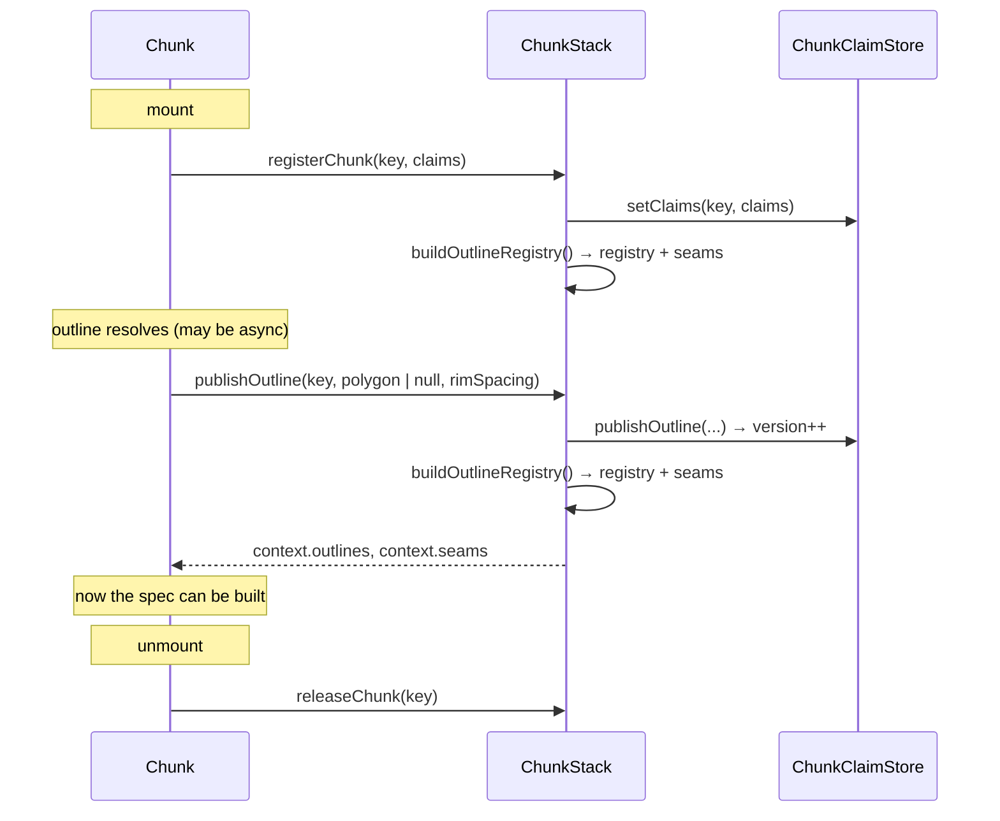
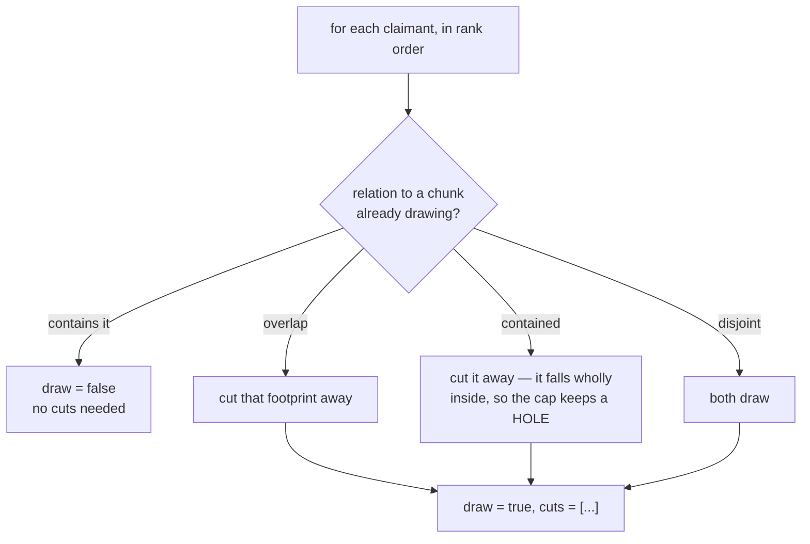
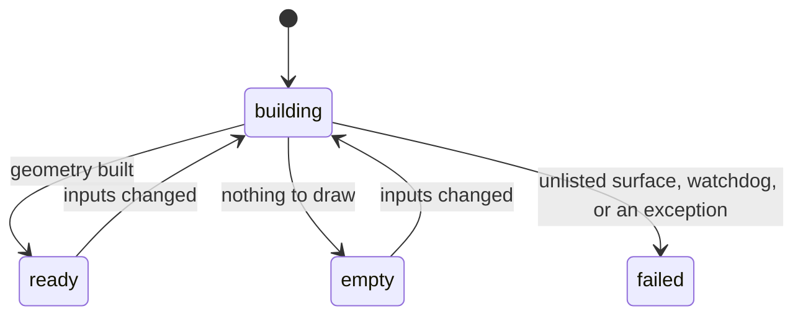

# Coordination between chunks

Chunks are independent siblings. They cannot see each other, yet three questions
can only be answered by looking at a neighbour:

1. *Do I draw this horizon, or does the chunk next to me?*
2. *My top layer was truncated against a surface I do not draw — is anything
   actually standing in for it?*
3. *How far along is the whole stack?*

`ChunkStack` brokers all three.

- [The registries](#the-registries)
- [Seams: who draws a shared horizon](#seams-who-draws-a-shared-horizon)
- [Cover above](#cover-above)
- [The four gates](#the-four-gates)
- [Build state and progress](#build-state-and-progress)
- [The margin ramp](#the-margin-ramp)

---

## The registries



`chunk-outline-registry.ts` holds this as **pure functions over a plain store**,
unit-tested in `tests/chunk-outline-registry.test.ts`. The store has two maps with
**deliberately different lifetimes**:

```ts
type ChunkClaimStore = {
  claims:   Map<string, ChunkSurfaceClaim[]>;   // what each chunk declares
  outlines: Map<string, SettledOutline>;        // what each chunk settled on
};
```

> ⚠️⚠️ **`clearClaims` must not touch the outline.** Claims change whenever a
> chunk's layers do, so the deregistration cleanup runs on a *re-registration* as
> often as on an unmount. Publishing the outline is a **different effect**, keyed on
> the outline, which would not re-run — so clearing the outline there leaves it
> unresolved forever, and every chunk sharing one of that chunk's horizons waits on
> it for good.
>
> This shipped once. The symptom was a silent stall: progress frozen at, say,
> "3/5 60%", no error, no worker running. The trace that proved it was
> `register k / publish k / unregister k / register k` with no second publish.
>
> `releaseChunk` — a separate context callback — drops both, and `Chunk` calls it
> from an **empty-dep effect through a ref**, so it fires on unmount only.

### Claims

```ts
type ChunkSurfaceClaim = {
  id: string;
  top: boolean;   // this surface is the chunk's LID
};
```

`top` is `i === 0 && chunkLayerFill(layer)` — **both halves matter**. A cap is the
lid of the block *underneath* it, so a chunk whose first layer is a bare sheet has
no block for it to be the lid of. Claiming it anyway lets a translucent sheet take
the horizon away from the solid block below, which is precisely the failure the
rule exists to prevent. (`top: i === 0` alone shipped once; removing a layer from a
story shifted an index and silently flipped seam ownership, so a chunk's inner
walls showed through.)

Only **real surfaces** take part. A synthetic plane belongs to no column, nothing
can be truncated against it there, and no neighbour can be drawing the same one.
The **carrier** is the exception: it is claimed under `CARRIER_SEAM_ID`
(`'@carrier'`) because it is one plane shared by every chunk whose last layer has a
fill.

### Entries

```ts
type ChunkOutlineEntry = {
  key: string;
  version: number;     // bumped when this chunk publishes a DIFFERENT footprint
  resolved: boolean;
  polygon: PlanarPolygonGeometry | null;
  rimSpacing?: number;
  top: boolean;
};
```

Three states, and telling the last two apart is essential:

| State | Meaning | What a waiting chunk should do |
|-------|---------|-------------------------------|
| not in the map at all | nobody claims that surface | proceed — there is nothing to share |
| `resolved: false` | claimed, outline still coming | **wait** — one render, versus a second full build |
| `resolved: true, polygon: null` | resolved to no footprint at all | **proceed** — it will never be anything |

> ⚠️ Mixing the last two hangs every chunk beneath a chunk whose wellbore outline
> no well reaches. That case is real and reachable on the demo data.

`version` exists because the registry is rebuilt **whole** on every publish, so its
identity churns whenever any sibling settles. A chunk consuming a neighbour's
footprint as a *cut* needs a content key it can memoise on:

```ts
const seamsKey = seamIds.map(id => {
  const d = stack.seams?.get(id)?.get(registryKey);
  if (!d) return '';
  return `${d.draw ? 1 : 0}/${d.cuts.map(c => `${c.key}@${c.version}`).join('+')}`;
}).join(',');
```

---

## Seams: who draws a shared horizon

Two chunks that meet **share their boundary surface**: the water/seabed chunk's
base *is* the detail chunk's top. That is the point — the tiers touch by
construction, with no gap and no fill to invent. The only problem is that the
surface is claimed twice, and drawing it twice means two independent tessellations
fighting for the same pixels.

`resolveSeam(claims)` in `seams.ts` settles it **from the footprints**. Claimants
are ranked:

1. **lid owner first** (`top`), then
2. **area descending**, then
3. **key** (so ties are deterministic).

and each draws its own footprint minus everything already taken:



> ⭐ **The lid rule, and why it matters beyond the feature.** A horizon belongs to
> the chunk it is the *lid* of, because a cap is the lid of the block underneath it
> — drawing it with that block's own material and opacity is what stops a
> translucent tier putting a see-through lid on an opaque one.
>
> An earlier version ranked by **area** alone. Draw and appearance then disagreed
> about the owner, which is the only reason appearance ever had to be published
> across a component boundary — and that channel produced a real bug (a seabed drawn
> at the *water* chunk's 0.45 opacity, because a layer naming no opacity means
> "my chunk's" and the wrong chunk resolved it). Making draw follow the same owner
> made appearance **purely local**, and the whole cross-chunk appearance channel was
> deleted.

A horizon that is nobody's lid — the carrier, typically — has no owner, which
leaves the area order: the widest draws it and the others cut around it. Two
identical outlines read as containment, so the tie is deterministic.

### How a cut is applied

`SeamDecision.cuts` become `SurfaceChunkSpec.cuts`, referenced per layer by
`capCuts`. In the worker they are densified with **their owner's `rimSpacing`** and
constrained into the tessellation, so the area the neighbour also covers is bounded
by real mesh edges rather than cut at triangle resolution. With both chunks
sampling the same reference grid, the seam is then **watertight**, not merely close.

> ⚠️ Densifying a cut with the *wrong* spacing puts the two boundaries on different
> points of the reference grid, and the seam opens a hairline crack. This is why
> `rimSpacing` travels with the footprint through the registry, the seam decision
> and the spec.

The residual, which is accepted: a detail chunk's walls meet a wider chunk's cap
across **two different tessellations**, so they agree only within `maxError`. No
z-fighting (only one surface is drawn), but a hairline is possible at grazing
angles.

`SurfaceChunkLayerDiagnostics.capped` and `.droppedExcluded` report the outcome,
and `constraintFailures` should be 0.

---

## Cover above

A chunk's **top layer** is truncated against the surface above it in the column —
a surface a *neighbouring* chunk draws, with its own (different) outline.

Dropping the truncated fragments is right where that neighbour covers the spot (two
coincident surfaces from two independent tessellations z-fight) and **wrong** where
it does not: there is nothing to fight with, and the drop leaves a hole into the
block.

`Chunk` therefore looks up the surface above its own top in the column, finds who
draws it, and passes that footprint as `SurfaceChunkSpec.coverAbove`. The top
layer's absence then applies only *inside* it. Only the top layer is affected —
every deeper layer's coincident partner is drawn by this same chunk with this same
outline, so it is always covered.

> ⚠️ Several chunks can draw parts of that horizon, and only one polygon fits in the
> spec, so the **widest** is used. `SurfaceChunkDiagnostics.topKept` measures how
> many vertices this saved; on real data it is ~0. This is **insurance, not a
> visible fix** — outlines usually nest.

---

## The four gates

`Chunk`'s `spec` memo returns `null` — and the chunk does not build — while any of
these holds:

| Gate | Meaning | Settles in |
|------|---------|-----------|
| `!outlineSettled` | a wellbore outline is still resolving | real I/O; **not** watchdogged |
| `coverAbove.pending` | the chunk above has registered but not published | a few frames |
| `seamsPending` | a surface claimed by >1 chunk has an unresolved claimant | a few frames |
| `columnPending` | this chunk's own claims have not reached `stack.column` yet | a few frames |

`columnPending` deserves a note: the stack builds its column from the surfaces its
chunks **claim**, and claims are registered in an effect — so on the first render
the column is empty for everyone. Without the wait, every chunk would build once
against a column missing its own layers and then rebuild.

The last three are pure bookkeeping between siblings. **None of the slow work
happens behind them**, so a gate still closed after `STALL_TIMEOUT_MS` (15 s) is a
deadlock, not a slow load — the watchdog reports `'failed'` and logs which gate is
still pending. `!outlineSettled` is deliberately *not* watchdogged; it has its own
`.catch(() => settle(null))`.

> ⚠️ **Every early return in the outline effect must settle.** An unsettled outline
> blocks this chunk *and* anything waiting on it, permanently, with no error. This
> shipped once: the effect took its depth window from `layers[0].surface`, which is
> `undefined` for a synthetic layer, and returned without settling. The symptom was
> "Building 0/1" forever.

A separate, non-waiting failure: a layer naming a surface the stack's `surfaces`
does not contain can **never** enter the column, so `columnPending` would wait
forever. That is a caller error and is knowable immediately, so it is reported as
`'failed'` at once with a console error naming the offending ids.

---

## Build state and progress



`'building'` covers outline resolution, waiting for a neighbour, **and** the worker
build, because from the outside they are the same thing: not ready yet.

> ⭐ **`'empty'` is an outcome, not a failure.** A chunk whose wellbore outline no
> well reaches, or whose footprint is cut away entirely because no surface is
> mapped there, has nothing to draw. Without a distinct state the progress bar hangs
> at 75% forever.

`ChunkStack.onProgress` aggregates the same signal:

```ts
type ChunkStackProgress = {
  total: number;      // chunks mounted
  building: number;
  completed: number;  // reached ready | empty | failed
  fraction: number;
};
```

Two honest caveats:

- **`total` grows as children mount.** The stack cannot know the count earlier, so
  the bar jumps at the very start.
- **It counts chunks, not work.** The first chunk of a shared column pays for the
  fetch, the resample and the resolve — roughly half the wall clock — so the bar
  sits near 0 for most of the time and then sprints. A smooth bar here would be an
  invented one; smoothing it properly needs phase-level progress out of the worker.

> ⚠️ A chunk that returns `null` never fires `onBuild`. Total silence looks
> identical to a hang — wire `onBuildStateChange` (or `onProgress`) to tell them
> apart.

---

## The margin ramp

Only relevant to wellbore-derived outlines in `'above'` / `'below'` mode (see
[outlines.md](./outlines.md)).

A chunk accumulating trajectory from *outside* its own depth window must buffer
each depth interval with the margin of the chunk that **owns** that interval — not
with its own. So it needs its neighbours' margins.

Each chunk publishes `{ key, topSurfaceId, baseSurfaceId, radius }` via
`publishMargin`; the stack sorts them **shallow → deep by the column** (a caller may
declare chunks in any order, and the ramp is a property of depth) and republishes
as `context.margins`.

Like `column`, the ramp is empty until children have registered, so a chunk waits
for **its own entry** to appear before building — otherwise it builds against a
half-registered ramp.
