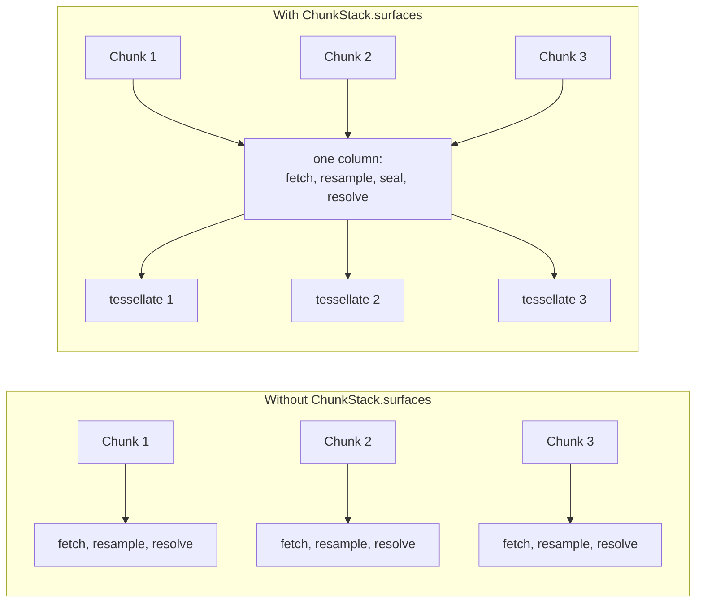
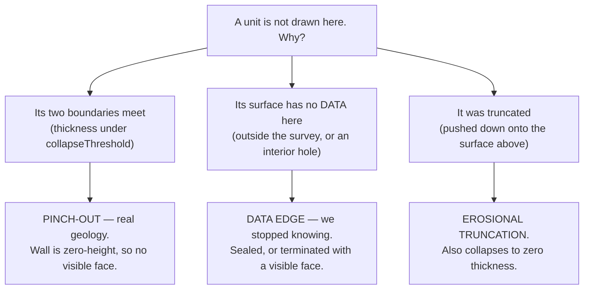

# The model

What a layer, an interval, a column and the special boundaries are — and why the
API is shaped this way rather than the obvious way.

- [Boundaries, not solids](#boundaries-not-solids)
- [Ordering is the caller's contract](#ordering-is-the-callers-contract)
- [Synthetic boundaries](#synthetic-boundaries)
- [The column](#the-column)
- [The carrier](#the-carrier)
- [Fluids](#fluids)
- [What "not present" means](#what-not-present-means)
- [Sealing](#sealing)
- [Contacts](#contacts)
- [Out of scope](#out-of-scope)

---

## Boundaries, not solids

The obvious API for a layered block is a list of solids: *"reservoir, from this
surface to that one"*. This library does not do that. A chunk is a list of
**boundaries** in stratigraphic order, and each boundary declares whether the
**interval below it** is filled.

```tsx
<Chunk
  layers={[
    { surface: a, fill: '#4e79a7' },  // volume between A and B, blue
    { surface: b, fill: true },       // volume between B and C, B's own colour
    { surface: c },                   // no volume below C
    { surface: d, fill: '#59a14f' },  // volume between D and E, green
    { surface: e },
  ]}
/>
```

```
   A ────────────────────   cap A
   ███████████████████████  interval A→B  (fill on A)
   B ────────────────────   cap B
   ███████████████████████  interval B→C  (fill on B)
   C ────────────────────   cap C
                            nothing  (no fill on C)
   D ────────────────────   cap D
   ███████████████████████  interval D→E  (fill on D)
   E ────────────────────   cap E
```

Why it is worth the slight awkwardness:

- **A gap between zones costs no new concept.** Omitting `fill` leaves the space
  open. The older API had *groups* — walls only within a group — which meant a
  group boundary was always a void, so a surface could never be the base of one
  zone *and* the top of the next. That forced callers into bookkeeping (slicing
  surface lists so no surface was used twice) that disappears entirely here.
- **A bare sheet is expressible.** `{ surface: m }` with no fill is a single
  clipped surface with no thickness and no wall — the "single-surface group" case,
  stated rather than implied.
- **Everything shares one rule.** Water, rock, void and the basement are all
  "a boundary, and what is under it".

Two material slots follow from the same idea (see [appearance.md](./appearance.md)):

| Prop | What it paints |
|------|----------------|
| `material` | the **cap** — what you see looking down at this boundary |
| `fill` | the **volume below** — the walls, the cut face, the body of the unit |

`fill: true` is shorthand for "the same as my own cap".

> ⚠️ `fill` defaults to **off**. A volume is something you ask for.

### The special case at the bottom

A `fill` on the **last** layer has no next boundary in the chunk to end against.
That is not an error — it means *the block is open at the bottom*, and the only
thing that can close it is the column's [carrier](#the-carrier). The carrier layer
is therefore **inferred** by `buildSurfaceChunkSpec`, not declared.

---

## Ordering is the caller's contract

> **The order of the `layers` array is the stratigraphic order, shallowest first.
> Nothing in the library infers it.**

This matters more than it looks. The build runs a **monotone resolve**: it walks
the stack from the top and clamps any surface that sits above the one over it. It
will happily make *any* order self-consistent, so a mis-ordered array does not
produce an error or an obviously broken picture — it produces a confident,
plausible, wrong one.

Two things follow:

- **Do not sort by depth.** `SurfaceMeta.min` / `.max` describe a surface's depth
  range over its *whole* extent, which is not its position inside your chunk's
  footprint. Sorting by either misorders real columns. Sort by **stratigraphic
  age**, which the host resolves from its own stratigraphic column data (surface
  name → unit → age). Sub-zone naming often counts *down* with depth
  (`Fm. 2.2` above `Fm. 2.1`), so name sorts get it backwards too.
- **Check the diagnostics.** `Chunk.onBuild` reports
  `metrics.diagnostics.crossings` and `crossingsCovered` — how many vertices were
  found out of order *before* the resolve enforced anything. A pair inverted over a
  large share of the footprint is nearly always an ordering mistake, not geology.
  See [sampling-and-perf.md](./sampling-and-perf.md#diagnostics).

The library deliberately does **not** carry stratigraphic-column, pick or
age data. Colour and order are host concerns; a wrong guess here would produce
exactly the kind of confident-looking error that is hardest to notice.

---

## Synthetic boundaries

A layer does not have to be backed by a surface. Omit `surface` and give one of:

| Field | Meaning |
|-------|---------|
| `depth` | absolute, metres below datum (positive-down) |
| `offset` | metres below the layer **above** — a floor that follows whatever it hangs from |
| `relief` | optional procedural perturbation of that plane (`StackRelief`) |

```tsx
layers={[
  { depth: 0, fill: '#2f6f9f' },      // a flat plane at sea level
  { surface: seabed, fill: '#c2b280' },
  { offset: 400 },                    // 400 m below the seabed
]}
```

Synthetic layers enter the reference grid like any other: `buildSyntheticChannel`
fills a channel over the common grid and gives it an **all-ones mask** (a plane is
defined everywhere), so it is tessellated, resolved, collapsed and walled by
exactly the same code.

Two consequences worth knowing:

- **`offset` hangs from the layer above**, so evaluation order is part of the
  contract. Both the standalone path and the shared-column path call the same
  `buildSyntheticChannel`, precisely so the two cannot drift apart.
- **A synthetic layer disqualifies the column's `preResolved` masks.** The column
  never saw that layer, so the depth order against it has to be enforced per chunk
  rather than once for the column. Cheap, but worth knowing when reading timings.
- **A flat plane contributes no refinement candidates**; one with `relief` does.
  Otherwise the relief would only be sampled where *other* layers happened to need
  detail.

---

## The column

`ChunkStack.surfaces` is the **column**: every surface any chunk of this stack may
draw, shallowest first.

Declaring it changes the build from *N independent chunks* to *one shared column,
sliced N ways*:



Two things are bought, and the second is the important one:

1. **Cost stays flat as chunks are added.** The fetch, the resample onto the common
   grid, the seal and the grid-level depth resolve happen once and are cached (see
   [build-pipeline.md](./build-pipeline.md#the-shared-column-cache)).
2. **Chunks agree with each other.** Without a column, each chunk resolves only its
   own layers, so two chunks can cross where their footprints overlap. With one,
   the ordering is settled at the grid nodes for the whole column; bilinear
   sampling is a convex combination, so an order true at every node is true at
   every sample point, and every chunk's own triangles preserve it.

The residual, with a shared column, is the two chunks' independent
tessellations, bounded by `2 × maxError`, and only where footprints overlap. If
you need exactness across a boundary, express it as **one chunk with two intervals**
rather than two chunks.

> ⚠️ The stack loads only the surfaces its chunks actually **claim**
> (`ChunkStackContextValue.column`). A surface nobody draws would otherwise be
> fetched, resampled and cascaded for nothing — but note it also stops acting as a
> *ceiling* in the monotone cascade. That is deliberate.

---

## The carrier

```tsx
<ChunkStack carrier={{ below: 800 }}>          // 800 m under the deepest sample
<ChunkStack carrier={{ depth: 2500 }}>          // absolute
<ChunkStack carrier={{ depth: 2500, material: '#6b6b6b' }}>
```

A flat plane closing the whole column. **Nothing pierces it** — anything that
would is truncated at it.

It is a **terminator**, not a surface with infinite thickness: there is no
interval below it, so it has a cap and no `fill`. What it needs is *authority*, in
two places:

1. `clampStackToCarrier` takes an elementwise `max` of every other channel against
   the plane. That is order-preserving, so "nothing pierces it" needs no cascade
   and cannot create a crossing — even though it reverses the stack's usual
   authority (the resolve pushes the deeper surface *down*; here the deeper one is
   pulled *up*). Safe only because the carrier is flat and complete.
2. The collapse is inverted for it: the carrier is never dropped against the layer
   above, and every other layer *is* dropped where it has been flattened onto the
   carrier. Everything else falls out of the ordinary thickness collapse — a
   clamped layer becomes coincident, hence zero thickness, hence dropped. The unit
   *above* a truncated horizon survives, because its interval is bounded by
   heights, not by masks. So the block is cut off flat rather than losing its
   bottom.

Why it belongs to the **column** and not to a chunk:

- Two chunks could otherwise hang different floors under one horizon, and that
  horizon would then have two heights.
- It gives the column's deepest surface a **neighbour below**, which is what the
  seal needs in order to keep it in proportion instead of pinning it to the one
  layer above.

`{ below: n }` can never truncate anything by construction (it is derived from the
deepest sample). Truncation only bites in `{ depth: n }` mode.

A chunk draws the carrier when its own **last layer declares a fill**. Several
chunks may do so; they all draw the same plane, so it is claimed in the seam
registry under `CARRIER_SEAM_ID` (`'@carrier'`) and resolved like a shared horizon.

---

## Fluids

A **fluid** boundary is a level rather than a horizon. Two separate properties are
involved, and keeping them apart is what makes both work:

| Property | Where | Meaning |
|----------|-------|---------|
| `fluid` | `StackResolveOptions.fluid` | ordered like any boundary, but **never the authority** — the monotone cascade looks *through* it to the nearest solid above |
| `unbounded` | `StackCollapseOptions.unbounded` | the sea only: covers the whole footprint whatever stands in its way, never absent, and its lid is tessellated on its own terms |

Why the cascade must look through a fluid: with shallow-wins truncation, an
ordinary boundary deeper than its unit's base would drag that base down with it.
For an oil/water contact that means an oil column with no water leg. For water
over ground it means the ground gets clamped *up* onto the water plane, becomes
coincident, and is dropped as a duplicate — the sea bed vanishes and the sea
covers everything.

With the exemption, ground rises **through** the plane. The shoreline then falls
out of the *interval* rather than the resolve: where the bed is above the level,
the water's thickness is zero, its triangles are collapsed, and the wall there is
zero-height.

> ⚠️ The inverted-wall clamp (`bottomY = min(bottom, top)` in `buildStackWalls`)
> applies to `fluid`, **not** to `unbounded`. A rim quad can straddle a shoreline,
> and without the clamp its bottom edge crosses its top edge and the quad turns
> inside out — painting the water body up the flank of an island. It is applied
> only for fluid pairs, because elsewhere the resolve guarantees the order and
> clamping would hide a real crossing.

The sea itself is declared on the **stack**, not on a chunk — see
[cutting-and-water.md](./cutting-and-water.md#the-sea).

---

## What "not present" means

A unit can fail to be present in three quite different ways, and the library
distinguishes them because they warrant different pictures:



The distinction is exact, not heuristic:

- **Thickness** is the difference of two linear interpolants over shared topology,
  so a triangle whose three corners are all thin is *entirely* thin. The test is
  per triangle and is exact.
- **Coverage** is binary and interpolates nothing, so the rule is per **corner**:
  any uncovered corner drops the triangle, which keeps the drawn area inside the
  mapped area. (This leaves a bite up to a triangle deep at a data edge; see
  [outlines.md](./outlines.md#coverage-and-the-data-edge) and
  `ChunkResolveOptions.constrainCoverage` for the exact fix.)
- A **visible** termination face is therefore always a data edge, because both
  ends of a thickness-driven boundary edge are collapsed and the face there is
  shorter than `collapseThreshold`.

### Truncation direction

Both resolvers cascade shallow → deep and clamp the **deeper** surface down.
**Shallow wins** = *erosional truncation*: the younger surface cuts into older
units. That is one of the two real cases; the other (onlap onto a paleo-high) is
equally real geology, and commercial tools carry an erosional/baselap flag per
horizon. This library does not, yet. Flipping the cascade is one line, but the
"poke through" it implies needs a hole cut in the chunk above with walls closed
around it, which is the end of the sealed-block guarantee.

---

## Sealing

Where a surface has no data, the block would simply open: both intervals it
bounds disappear while the surfaces above and below are still drawn, leaving a cap
floating over a floor with open space between.

`ChunkResolveOptions.seal` (default **on**) closes it, and there is no neutral way
to do so — we know the room between the neighbours, we just do not know how it is
divided. Two modes state different things:

| Mode | What it asserts | Picture |
|------|-----------------|---------|
| `'proportional'` (default) | *this horizon exists here, we are unsure exactly where* | the surface keeps its relative depth between its neighbours; both units survive, thinner |
| `'void'` | *the units are not defined here* | the surface splits in two — one copy closing the interval above, one the interval below — with nothing drawn between |

`'proportional'` carries the ratio `r = (A−B)/(A−C)` from the nearest mapped node
and rebuilds `B = A − r·(A−C)`. Because `B` is strictly between its neighbours,
monotonicity is free. It falls back to a one-sided taper only where there is a
single neighbour (the ends of a column — which is another reason to declare a
carrier).

`'void'` is implemented as **two layers with an unfilled interval between them** —
i.e. the ordinary "gap between zones", so caps, walls, collapse and tracing all
work unchanged. It is self-documenting: the hole in the block *is* the statement,
so it needs no legend and cannot be mistaken for geology. The trade is that it
removes material we know exists.

Shape and reach are **derived, not configured**: the taper's run is the unmapped
region's own inward reach (measured inside the footprint), its profile is a fixed
quarter arc, and its travel is slope-bounded by `TAPER_MAX_SLOPE` so a narrow
ditch between distant surfaces dimples rather than diving the full gap. The single
setting is:

- `minThickness` (metres, default `TAPER_MIN_THICKNESS` = 1) — how much of each
  neighbouring unit the seal must leave standing. Absolute rather than a
  percentage, since a percentage grows with the room it sits in.
  ⚠️ Keep it **above** `collapseThreshold`, or the sliver it leaves is dropped for
  having no thickness and the hole it closed comes back.

Sealing invents geometry, so it deliberately overrides `coverageAbsence` (which
would drop the wedge again) and the coverage trim (which would cut the outline back
to the very area the wedge covers). The invented share is reported per layer as
`inferred`, and marked in the picture by default — see
[appearance.md](./appearance.md#marking-the-inference).

The seal runs **once, on the column**, before the grid resolve, so a horizon two
chunks share ends up with one height. (It used to run per chunk, and the symptom
was exactly what you would predict: a chunk's bottom open where a neighbouring
chunk contained it, because the two had sealed the same horizon against different
neighbours.)

---

## Contacts

A fluid contact — oil/water, gas/oil, free water level — is **not** a boundary in
the stack. It is declared on `ChunkStack.contacts` as a depth grid and drawn as a
**line** wherever a drawn face crosses it.

```tsx
<ChunkStack contacts={[{ surface: owcGrid, type: 'owc' }]}>
```

That is deliberate:

- It takes no part in the depth order, so it can neither truncate a horizon nor be
  truncated by one.
- Changing one rebuilds **no geometry at all** — it is pure appearance.
- One shader test yields both the outline on a cap and the horizontal line on a
  wall or a cut face.

Types are `'goc' | 'gwc' | 'owc' | 'hwc' | 'fwl'`, each with a default colour
(`CHUNK_CONTACT_COLORS`). A contact is drawn on every layer unless a layer opts out
with `contacts: [ids]` or `contacts: false` — restricting a contact to the units
that actually hold that fluid is *interpretation*, and belongs to the host.

An alternative modelling choice, if a contact should split a unit into two
differently-coloured parts, is to make it an ordinary `fluid` boundary in the
`layers` array. That keeps it in the shared tessellation, which is what stops it
z-fighting with the layers around it.

---

## Out of scope

- **Faults.** A height field cannot carry a discontinuity. Gridded surfaces carry
  a fault as a steep flexure, and that is what gets drawn. Detect and report;
  do not mangle. Reverse and overturned geometry is impossible by representation.
- **Colour from stratigraphy.** Name → unit → colour is company-specific mapping
  and belongs to the host.
- **Guessing an order.** A surface with no age should be excluded, not
  interpolated into position. Guessing produces a plausible picture, which is the
  worst failure mode available.
