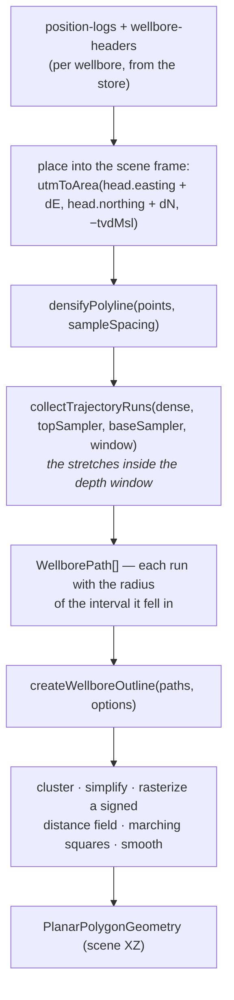

# Outlines and coverage

Which footprint a chunk is clipped to, where that footprint comes from, and what
happens where a surface has no data inside it.

- [Cut sources](#cut-sources)
- [Per-chunk overrides](#per-chunk-overrides)
- [Wellbore-derived outlines](#wellbore-derived-outlines)
- [Accumulation modes](#accumulation-modes)
- [The envelope](#the-envelope)
- [Bounded fill](#bounded-fill)
- [Coverage and the data edge](#coverage-and-the-data-edge)

---

## Cut sources

```ts
type CutoutSource =
  | { kind: 'polygon'; polygon: PlanarPolygonGeometry }
  | { kind: 'wellbores'; wellbores: string[]; options?: WellboreCutoutOptions };
```

A stack declares a default; a chunk inherits it or overrides it:

```tsx
<ChunkStack outline={fieldPolygon}>          {/* everyone gets this */}
<ChunkStack cutSource={{ kind: 'wellbores', wellbores: ids, options }}>

<Chunk />                                    {/* outline="inherit", the default */}
<Chunk outline={somePolygon} />              {/* an explicit footprint */}
<Chunk outline={{ kind: 'wellbores', options: { radius: 1500 } }} />  {/* override */}
```

`cutSource` takes precedence over `outline` when both are set (an explicit
`{ kind: 'polygon' }` source is equivalent to `outline`).

A polygon source resolves **synchronously**. A wellbore source resolves
**asynchronously**, from the chunk's own bounding surfaces plus the wellbore data
— which is why `outlineSettled` is a build gate (see
[coordination.md](./coordination.md#the-four-gates)).

---

## Per-chunk overrides

`resolveCutoutSource(outline, stackSource)` is pure and small, and its merge
semantics are the useful part:

| `Chunk.outline` | Result |
|-----------------|--------|
| `'inherit'` (default) | the stack's source, as-is |
| a `PlanarPolygonGeometry` | wrapped as a polygon source |
| `{ kind: 'polygon', … }` | used directly |
| `{ kind: 'wellbores', wellbores?, options? }` | `wellbores` falls back to the stack's set; `options` are **shallow-merged over** the stack's, per key |

So `outline={{ kind: 'wellbores', options: { radius: 1500 } }}` widens *one*
chunk's buffer while inheriting everything else. Full replacement is rarely what
you want.

---

## Wellbore-derived outlines

The idea: a chunk's footprint is *where the wells are*, buffered — so a deep chunk
is a small blob around the reservoir penetrations while a shallow one covers the
whole platform area.

`resolveWellboreOutline` (component side) → `createWellboreOutline` (SDK):



Key points:

- **The position log is head-relative and MSL-normalised.** The scene point is
  `utmToArea(head.easting + dE, head.northing + dN, -tvdMsl)` — exactly the frame
  the surfaces use, so samplers and surfaces can be compared directly.
  ⚠️ `utmToArea`'s signature is `(easting, northing, altitude)`. Depth is the
  **third** argument. Getting that wrong puts every trajectory point at
  northing-scale coordinates, every sampler returns null, and nothing renders.
- **The depth window is tested against the chunk's own bounding surfaces**, sampled
  at each trajectory point's XZ (`createSurfaceDepthSampler`), not against the
  stack. A chunk is never limited by what its neighbour happens to cover.
- **Runs, not points.** `collectTrajectoryRuns` returns contiguous stretches, and
  window crossings are interpolated — so `sampleSpacing` is a *cost* knob, not a
  correctness one.

### Options (`WellboreCutoutOptions`)

Orchestration knobs added by the component layer:

| Option | Default | Meaning |
|--------|---------|---------|
| `mode` | `'window'` | which part of each well counts — see below |
| `unmapped` | `'exclude'` | what to do where a bounding surface has no data at a sample. This is what decides whether a hole in a chunk's deep base surface also removes that area from its outline |
| `sampleSpacing` | 50 | trajectory sampling spacing, scene units |
| `tolerance` | 0 | vertical slack widening the depth window, so wells grazing a bounding surface are still captured |

…on top of the SDK's `WellboreOutlineOptions`: `radius` (default 500),
`minRadius` / `maxRadius`, `cellSize` (default `DEFAULT_OUTLINE_CELL_SIZE` = 100,
also clamped to `minRadius / OUTLINE_CELLS_PER_RADIUS`), `maxCells` (default 1e6),
`simplify`, `shapeFn` (angular radius modulation, for organic edges), `feather`,
`smoothing`, `minRingArea`, and `onMetrics`.

> ⚠️ **Cost.** The field is `O(nodes × paths)` and nodes go as `area / cellSize²`,
> so halving `cellSize` quadruples the raster. Keep `cellSize` ≥ 150–200 and
> `sampleSpacing` ≥ 50–100 at field scale, and watch
> `WellboreOutlineMetrics.coarsened`, which reports when `maxCells` forced a cell
> larger than the radius needs (i.e. an under-resolved buffer).

> ⚠️ This still runs on the **main thread**. It is fine at field scale, but it is
> multiplied by the number of chunks.

---

## Accumulation modes

`WellboreOutlineMode` decides which part of a well counts:

```
        'window'              'above'               'below'
      ┌──────────┐        ┌──────────┐          ┌────────────────┐
  A   │   ▓▓▓    │        │   ▓▓▓    │          │ ▓▓▓▓▓▓▓▓▓▓▓▓▓▓ │
      ├──────────┤        ├──────────┤          ├────────────────┤
  B   │  ▓▓▓▓▓   │        │  ▓▓▓▓▓▓  │          │   ▓▓▓▓▓▓▓▓▓▓   │
      ├──────────┤        ├──────────┤          ├────────────────┤
  C   │ ▓▓▓      │        │ ▓▓▓▓▓▓▓▓ │          │      ▓▓▓       │
      └──────────┘        └──────────┘          └────────────────┘
      unrelated           telescopes OUT        narrows with depth
      footprints          (nested)              (nested)
```

- `'window'` — only the trajectory inside the chunk's own depth window. Footprints
  vary per chunk with no relation between them.
- `'above'` — everything from the **wellhead** down to the chunk's base. The point
  set grows with depth, so outlines nest and the stack telescopes out.
- `'below'` — everything from the chunk's top down to **TD**. The mirror image.

The nesting in `'above'` / `'below'` is what makes the [margin
ramp](./coordination.md#the-margin-ramp) necessary: each stretch of trajectory must
be buffered with the margin of the chunk that **owns** that depth interval, or a
deeper chunk with a smaller radius could produce an outline that is *not* contained
in the shallower one's.

> ⚠️ A wellbore outline resolving to **nothing** is a normal outcome, not a bug —
> the deepest chunk of a telescoping stack may have no well reaching it. That chunk
> reports `'empty'`.
>
> There is currently no declared *fallback* when an outline resolves empty
> (inherit the window above, or use a given polygon). Widening `tolerance` is the
> available lever.

---

## The envelope

`ChunkStackContextValue.envelope` is the footprint the **column's common grid** is
built over. It must **contain every chunk's outline**, because it defines the grid
they all sample.

- With a plain `outline` or a polygon `cutSource`, the envelope is that polygon.
- With a **wellbore** `cutSource`, the stack resolves it over the **full depth
  window** — `surfaces[0]` to `surfaces[last]` — with the **widest** margin any
  chunk has published. More trajectory points can only grow the outline, so the
  full-window outline contains every chunk's narrower one by construction.

> ⚠️ The envelope drives `referenceNodes`, and everything downstream scales with
> it. A stack whose envelope is a whole survey rectangle rather than a field-sized
> crop pays for the difference in every phase. See
> [sampling-and-perf.md](./sampling-and-perf.md).

---

## Bounded fill

A real grid is incomplete in two ways: **interior holes**, and a mapped area
**smaller than its rectangle**. Both are filled from the nearest real sample so the
surface stays continuous (a cliff at a data edge would create a sliver cluster for
the triangulator to chase). `ChunkResolveOptions.maxFill` decides **how far that
fill is trusted**:

```
  maxFill = 0        maxFill = 300 m       maxFill = 1000 m
  ┌────────────┐     ┌────────────┐        ┌────────────┐
  │  ○      ●  │     │  ·      ●  │        │  ·      ·  │   ○ small hole
  │            │  →  │            │   →    │            │   ● large hole
  │      ◯     │     │      ◯     │        │      ○     │   ◯ huge hole
  └────────────┘     └────────────┘        └────────────┘
   all absent        small one bridged,    large one bridged,
                     large ones eroded     huge one still there
```

> ⭐ **It behaves as an erosion radius, not a size test.** A hole of radius `r`
> disappears exactly at `maxFill = r`; a larger one merely loses a rim of that
> width. That is what lets one threshold cope with holes spanning three orders of
> magnitude, which real data does.

The implementation is nearly free: `chamferFill` already computes the distance to
the nearest real sample and used to discard it — `maxFill` simply thresholds it,
converting metres to cells through the reference header's own `(xinc + yinc) / 2`
so it survives `maxNodes` decimation.

The default is `DEFAULT_CHUNK_MAX_FILL` = 250 m. That was chosen against one demo
field (interior holes of 0.06–0.23 km², i.e. radii of 140–270 m, apart from three
far larger ones) — treat it as a starting point, not a constant of nature.

> ⚠️ **Coverage bought this way IS fill** — a plausible extrapolation, not
> knowledge. `SurfaceChunkLayerDiagnostics.filled` reports the share of a layer's
> `coverage` that is fill, precisely so a layer standing on very little is visible.
>
> ⚠️ `maxFill` applies even when `resolve` is omitted: the common grid is built
> either way, and how far its fill is trusted is a property of that grid.

---

## Coverage and the data edge

Where a layer has no data, what should be drawn?

| `ChunkResolveOptions` | Effect |
|-----------------------|--------|
| `seal: true` (default) | close the block by tapering the surface toward its neighbours; the region is drawn and **marked as inferred** |
| `seal: false`, `coverageAbsence: true` (default) | drop the triangles — the surface simply ends |
| `seal: false`, `coverageAbsence: false` | draw on the hole fill, unmarked — the dishonest version, kept for comparison |

With sealing on, `coverageAbsence` is forced off internally: it would drop the very
wedge the seal just built.

### The bite and the comb

Without a constraint, a layer's data boundary is only a **per-vertex mask**, so a
triangle straddling it has to be resolved one way or the other. The rule chosen —
*any uncovered corner drops the triangle* — keeps the drawn area inside the mapped
one, but it leaves:

- a **bite** up to a triangle deep along the edge, and
- a **comb** of surviving slivers where the edge runs at an angle to the mesh.

This is a **scale** effect: `collectCoverageCrossings` forces a one-cell-spaced
vertex chain along the edge, while interior triangles are far larger, and long
triangles reaching from the dense chain into the sparse interior get dropped whole.

> ⚠️ The intuition that "lower `maxError` shrinks the bite" is **wrong** — measured
> behaviour is the opposite. Do not re-derive that story.

### `constrainCoverage` — the exact fix

`ChunkResolveOptions.constrainCoverage` (default **off**) traces each layer's mask
boundary and **constrains** it into the shared tessellation, exactly as the rim is.
No triangle then straddles a data edge, so the drop rule becomes an exact per-
triangle centroid test. It kills both the bite and the comb.

It also **supersedes** `refineCoverage`, which defaults off when it is on: that
pass exists only to put vertices *near* an unconstrained data edge, and a
constraint puts them *on* it. Measured on real data, that trade made the triangle
count go **down**, not up, because the constraint replaces the forced one-cell
chain.

The cost is vertices along every partly-mapped layer's boundary, in a tessellation
the whole stack shares. `SurfaceChunkDiagnostics.coverageRingPoints` reports it.

> ⚠️ **Do not simplify the traced rings.** RDP makes a rectilinear ring cross
> itself where two staircase arms pass within the tolerance, and the noder skips
> same-ring pairs — so the constraint is silently not enforced (measured: 36
> `constraintFailures` at a one-cell tolerance, 0 with the raw trace).

### What a data edge should look like

There are three distinct reasons a unit can end, and they deserve three
appearances:

| Cause | Honest reading |
|-------|----------------|
| the chunk **outline** | a deliberate, arbitrary cut — admit it |
| a **pinch-out** | real geology; the surfaces already meet, so no wall is needed |
| a **data edge** | *we stopped knowing* — the most important one not to disguise |

Two of those are handled by the geometry itself (a pinch-out's wall is
zero-height), and the third by the inference marking — see
[appearance.md](./appearance.md#marking-the-inference).

> ⭐ This is also the argument against *piecewise* walls per surface extent: a wall
> is a **cut face**, and drawing one at a data edge claims the unit *terminates*
> there, which is the most confident lie available. Sealing or terminating with a
> marked face are the honest options.
