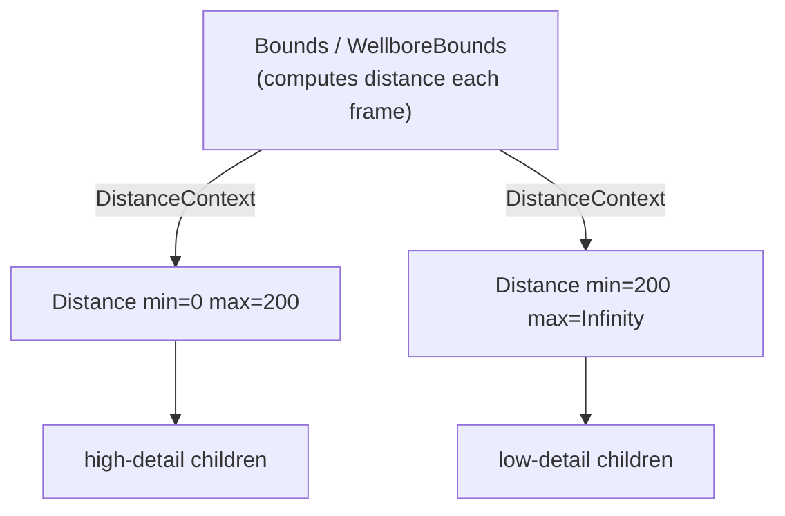

# Distance & bounds (level of detail)

This library renders large scenes — an oil field can span tens of kilometres while a
single wellbore detail is sub-metre. To keep such scenes performant and readable, you
often want to show different content depending on how close the camera is: a cheap
placeholder far away, full detail up close. The `Distance` component and its bounds
providers are the building blocks for this distance‑based level of detail (LOD).

## The pieces

| Piece | Role |
|--|--|
| [`DistanceContext`](../src/components/Distance/DistanceContext.ts) | Carries the current camera‑to‑object distance (a `{ current: number }`), updated each frame. |
| [`Bounds`](../src/components/Distance/Bounds.tsx) | **Generic** provider — publishes the distance from a supplied `sphere`, `box` or `position`. |
| [`WellboreBounds`](../src/components/Wellbores/WellboreBounds/WellboreBounds.tsx) | Wellbore‑specific provider — publishes the distance from a generated wellbore bounds. |
| [`Distance`](../src/components/Distance/Distance.tsx) | **Consumer** — shows/hides (or mounts/unmounts) its children based on that distance. |

A **provider** computes the distance and puts it on the `DistanceContext`; one or more
`Distance` **consumers** below it read that value. A `Distance` therefore only works
inside a `Bounds` or `WellboreBounds` (without a provider the distance is `Infinity`,
so any `Distance` with a finite `max` stays hidden).



## `Distance`

Conditionally renders its children while the camera distance is within `[min, max)`.

| Prop | Default | Meaning |
|--|--|--|
| `min` | `0` | Lower distance bound (inclusive). |
| `max` | — | Upper distance bound (exclusive). Required. |
| `onDemand` | `false` | When `true`, children are **mounted/unmounted** on entering/leaving range (frees their resources when far away). When `false`, they are only toggled `visible`. |

Use `onDemand` for heavy children (large geometries, data‑driven components) so they are
not kept in memory when out of range; leave it off for cheap children that swap often, to
avoid remount cost.

## `Bounds` (generic provider)

Publishes the `DistanceContext` from a bounds you supply, so `Distance` works for **any**
object — not just wellbores.

| Prop | Meaning |
|--|--|
| `sphere` | `{ center, radius }` bounding sphere (local space). Highest precedence. |
| `box` | `[min, max]` bounding box (local space). |
| `position` | A single point (local space). Lowest precedence. |

The distance is measured in the component's **local space** (so parent transforms apply)
and divided by `camera.zoom`, matching `WellboreBounds` — so `Distance`'s `min`/`max`
behave identically under either provider. If several shapes are given the precedence is
`sphere` → `box` → `position`; with none the distance stays `Infinity`.

```tsx
import { Bounds, Distance } from '@equinor/videx-3d'

<Bounds sphere={{ center: [0, 0, 0], radius: 5 }}>
  <Distance min={0} max={50}>
    <mesh>
      <sphereGeometry />
      <meshStandardMaterial color="red" />
    </mesh>
  </Distance>
  <Distance min={50} max={Infinity}>
    <mesh>
      <boxGeometry />
      <meshStandardMaterial color="blue" />
    </mesh>
  </Distance>
</Bounds>
```

## `WellboreBounds` (wellbore provider)

Provides the `DistanceContext` for a wellbore, computed from a generated bounds (a main
sphere plus sampled sub‑spheres along the trajectory, so the distance is accurate even
for long, deviated wells). Wrap wellbore visualization components in it to drive their
LOD:

```tsx
import { Wellbore, WellboreBounds, Distance } from '@equinor/videx-3d'

<Wellbore id={wellboreId}>
  <WellboreBounds id={wellboreId}>
    <Distance min={0} max={2000}>
      {/* near‑field detail, e.g. casings */}
    </Distance>
  </WellboreBounds>
</Wellbore>
```

## Composing multiple swaps

Bands under one provider are just siblings. Keep them contiguous (`[0, a) [a, b)
[b, ∞)`) so exactly one shows at a time:

```tsx
<Bounds sphere={{ center: [0, 0, 0], radius: 2 }}>
  <Distance min={0} max={near}>{/* high detail */}</Distance>
  <Distance min={near} max={far}>{/* medium detail */}</Distance>
  <Distance min={far} max={Infinity}>{/* placeholder */}</Distance>
</Bounds>
```

## Real‑world example: tanker LOD

Swap a full‑detail vessel for a low‑poly one by distance — high triangle counts only when
the camera is close:

```tsx
import { Bounds, Distance } from '@equinor/videx-3d'
import { Tanker } from '@equinor/videx-3d'

<Bounds sphere={{ center: [0, 0, 0], radius: 130 }}>
  <Distance min={0} max={lodDistance}>
    <Tanker lengthSegments={128} profileSegments={16} details="high" />
  </Distance>
  <Distance min={lodDistance} max={Infinity}>
    <Tanker lengthSegments={12} profileSegments={4} details="low" />
  </Distance>
</Bounds>
```

See the **Components / Misc / Distance** stories in Storybook (`Default`,
`MultipleBands`, `Tanker LOD`) for interactive versions.

## See also

- [Architecture](./architecture.md)
- [Generators](./generators.md)
