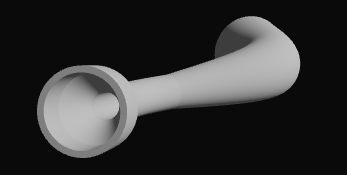

# Getting Started

## Creating a React app

First, we need a basic React web application running. At the time being this must be React v18 due to missing support for v19 in peer dependencies.

To create a new React v18 app, you can use Next.js:

```
npx create-next-app@14
```

Please note that we have to use next version 14 for react v18!

## Installing peer dependencies

Besides React, we will also need threejs, react three fiber and comlink:

```
npm install three @react-three/fiber comlink
```

## Make a simple 3d scene

Before adding the `videx-3d` components library we should create a basic 3d scene to make sure everything is working. Feel free to skip this section if you are already familiar with Three.js and React Three Fiber.

In this example, we will be using typescript. We start by creating a new file for a component named "Test.tsx":

```tsx
'use client' // <-- if using next

// Test.tsx
import { Canvas } from '@react-three/fiber'

export const Test = () => {
  return (
    <Canvas>
      <mesh>
        <boxGeometry />
        <meshBasicMaterial />
      </mesh>
    </Canvas>
  )
}
```

Then import this file and render the Scene component in your app:

```tsx
// page.tsx
import { Test } from './Test'

export default function Home() {
  return (
    <div style={{ width: `100vw`, height: `100vh` }}>
      <Test />
    </div>
  )
}
```

You should see the face of a white cube like this:


Let's review what we just done. The `Canvas` component adds a HTML Canvas DOM element and connects it to Three.js. This includes adding the `Scene` and `WebGLRenderer` instances from `Three.js`.

**Important**: You can only add react three fiber child components to the `Canvas` component. Adding HTML components, such as `<div />` will generate an error.

Next, we add a `mesh` element. This maps to the `Mesh` class in Three.js, and defines a 3d object that will be added to the Three.js `Scene`. A Mesh consists of a geometry and a material. The geometry _describes_ the shape of the object, while the material determines the _look_ of the shape.

We added a `boxGeometry` to the mesh, which will create a simple cube geometry and a `meshBasicMaterial` which, by default, will color the object white.

Notice that the coloring is uniform across the entire shape and there is no percieved depth yet. We will fix that shortly.

### Camera controls

First let's add a camera control, so we can interact with the 3d scene. You will find a number of camera controls as well as other usefull components from [drei](https://github.com/pmndrs/drei), so let's add that package:

```
npm i @react-three/drei
```

We can now update our `Test.tsx` file and add the `CameraControls` component:

```diff
// Test.tsx

+import { CameraControls } from '@react-three/drei'
import { Canvas } from '@react-three/fiber'

export const Test = () => {
  return (
    <Canvas>
+      <CameraControls />
      <mesh>
        <boxGeometry />
        <meshBasicMaterial />
      </mesh>
    </Canvas>
  )
}
```

You should now be able to control the rotatation, position and zoom of the camera.

### Lights

We would like for our cube to appear more _3d_. We can use a different material to acheive this:

```diff
  // Test.tsx

  <mesh>
    <boxGeometry />
-   <meshBasicMaterial />
+   <meshStandardMaterial />
  </mesh>
```

You might have noticed that our cube disapeared! This is because the `MeshStandardMaterial` required light to determine how the object should be shaded - and since we have not added any light, our cube is in the dark! 

Let's add some basic light:

```diff
  // Test.tsx

  <Canvas>
+   <ambientLight intensity={0.2}/>
+   <directionalLight intensity={1.2} position={[1, 2, 3]}/>
    <CameraControls />
    <mesh>
      <boxGeometry />
      <meshStandardMaterial />
    </mesh>
  </Canvas>
```
The `ambientLight` is used to simulate basic light scattering, where light is cast from all directions with the same intensity. Alone, this would look similar to the `meshBasicMaterial`, so we also added a `directionalLight`, which will simulate a distant light source (such as the sun) with the direction derrived from the position we give it. Note that moving this light further away will not have any effect other than the angle of the light changing. 

Our cube should now be illuminated and look something like this:


### Refactor
When working with React we create components, and thanks to react three fiber we are able to do this also for our 3d objects. Let's do some refactoring and changes to see how this works!

First, let's seperate our cube into its own compoent by creating a new file `Cube.tsx`:

```tsx
// Cube.tsx

export const Cube = () => {
  return (
    <mesh>
      <boxGeometry />
      <meshStandardMaterial />
    </mesh>
  )
}
```

We then update the `Test.tsx` to include this component:

```diff
// Test.tsx

  <Canvas>
    <ambientLight intensity={0.2}/>
    <directionalLight intensity={1.2} position={[1, 2, 3]}/>
    <CameraControls />
-   <mesh>
-     <boxGeometry />
-     <meshStandardMaterial />
-   </mesh>
+   <Cube />
  </Canvas>
```

If we add multiple cubes, they will render on top of eachother, so let's add some props to our component to allow some control:

```tsx
// Cube.tsx

type Props = {
  position?: [number, number, number]
  color?: string
}

export const Cube = ({ position = [0, 0, 0], color = 'white' }: Props) => {
  return (
    <mesh position={position}>
      <boxGeometry />
      <meshStandardMaterial color={color} />
    </mesh>
  )
}
```

We can now add multiple cubes by positioning them apart:

```diff
  // Test.tsx

  <Canvas>
    <ambientLight intensity={0.2}/>
    <directionalLight intensity={1.2} position={[1, 2, 3]}/>
    <CameraControls />
    <Cube />
+   <Cube position={[-2, 0, 0]} color="red" />
+   <Cube position={[2, 0, 0]} color="blue" />
  </Canvas>

```

Finally, let's try to make our cubes rotate. To do this we'll need to update the object's transformations on each frame. React Three Fiber provides the hook  `useFrame` for this purpose:

```diff
  // Cube.tsx

  export const Cube = ({ position = [0, 0, 0], color = 'white' }: Props) => {
+   const ref = useRef<Mesh>(null)

+   useFrame(() => {
+     if (ref.current) {
+       ref.current.rotateX(0.01)
+     }
+   })

    return (
-     <mesh position={position}> 
+     <mesh ref={ref} position={position}>
        <boxGeometry />
        <meshStandardMaterial color={color} />
      </mesh>
    )
}
```

This will rotate the cube 0.01 radians per frame along the x-axis. So the cubes will rotate twice as fast at 120 fps compared to 60 fps. This is typically not desired, so we should update the angle according to time instead. We can fix this by getting a reference to the delta time provided as the second argument in the `useFrame` callback function:

```diff
- useFrame(() => {
+ useFrame((_, delta) => {
    if (ref.current) {
-     ref.current.rotateX(0.01)
+     ref.current.rotateX(delta)
    }
  })

```

This was a really basic introduction to React Three Fiber and Three.js. There are tons of resources on both libraries scattered around the web, but start at the official documentation sites:
- https://r3f.docs.pmnd.rs/getting-started/introduction
- https://threejs.org/
- https://threejs.org/docs

## Add the videx-3d library
While Three.js and React Three Fiber provides all you need to create 3d content for the web with React, the `videx-3d` library adds ready to use components and features specifically targeting sub surface visualizations.

Let's start by adding the package to our project:

```
  npm i videx-3d
```

We will start simple, and experiment with the `createTubeGeometry` function from the SDK. This is a very flexible procedure for generating tube shapes. It is based on the implementation of the `TubeGeometry` from Thee.js, but heavily adapted to the needs of this library as you will see.

A tube is basically a curve with dimensions, and to define a smooth curve from a set of points we need to interpolate. The SDK includes a function `getSplineCurve`, which takes a set of 3d coordinates and returns an interpolator as defined by the `Curve3D` interface. Our implementation is using the [curve-interpolator](https://github.com/kjerandp/curve-interpolator) library, which is set up to interpolate a chordal cubic Hermite spline curve. You can use your own interpolation implementation as long as it implements the `Curve3D` interface.

In this example we will create a new component, which will generate a tube geometry and render it using the standard material from Three.js. Let's create a new file and component `Tube.tsx`:

```tsx
import { useMemo } from 'react'
import { createTubeGeometry, getSplineCurve, Vec3 } from 'videx-3d/sdk'

type Props = {
  points: Vec3[]
}

export const Tube = ({ points }: Props) => {
  const curve = useMemo(() => getSplineCurve(points), [points])

  const tubeGeometry = useMemo(() => {
    if (curve) {
      const geometry = createTubeGeometry(curve)
      return geometry
    }
    return null
  }, [curve])

  if (!tubeGeometry) return null

  return (
    <mesh geometry={tubeGeometry}>
      <meshStandardMaterial />
    </mesh>
  )
}

```
As you can see, we use the standard way of creating React components, with the familiar hooks and conventions. We expect a set of 3d coordinates as an array of type `Vec3`, which is simply defined as `[number, number, number]`.

We pass those points to the `getSplineCurve` function to get our interpolator, which we then use to generate the tube geometry, using the `createTubeGeometry` function. Note that the `getSplineCurve` function may return `null` if the input is not valid.

We return a mesh element, this time passing the generated geometry as a prop to the mesh element instead of as a child component like we did with the cube example. This acheives the same thing, as React Three Fiber will _attach_ a geometry element to the mesh object geoemetry property if present. We could do the same thing for the material, if we created an instance of a material like we did with the tube geometry.

Let's replace the cubes from our earlier example with the new Tube component:

```tsx
'use client' // <-- if using next

// Test.tsx

import { CameraControls } from '@react-three/drei'
import { Canvas } from '@react-three/fiber'
import { Tube } from './Tube'

export const Test = () => {
  return (
    <Canvas>
      <ambientLight intensity={0.2}/>
      <directionalLight intensity={1.2} position={[1, 2, 3]}/>
      <CameraControls />
      <Tube points={[[1.2, -3, 10], [2, -5, 15], [10, -5, 14.5], [12, -5, 17.5]]}/>
    </Canvas>
  )
}

```
This will look a bit unexpected perhaps:


This is because we didn't pass any options to the `createTubeGeometry` function. The obvious problems we see is that the curve is not smooth at all, and it doesn't seem to react to light. In fact, it's only illuminated by the ambient light. Objects need to include _normals_ for light calculations to work, and our function doesn't compute these by default.

The smoothness issue can be resolved by specifying a number of segments we would like per unit, which is, by convention of this library, given in meters. 

So let's add the following:

```diff
  const geometry = createTubeGeometry(
    curve,
+   {
+     segmentsPerMeter: 20,
+     radialSegments: 60,
+     computeCurveNormals: true
+   }
  )
```
I've also added a higher than default number of radial segments to make the tube appear more circular, and this is the result (from a slightly different angle though): 


Let's see what else we can do. One thing you might have notices is the odd looking ends of the tube. It seems like something is missing, and indeed it is. We can fix this by adding _caps_:

```diff
  {
    segmentsPerMeter: 20,
    radialSegments: 60,
    computeNormals: true,
+   startCap: true,
+   endCap: true,
  }
```

And we get this:


By default, the radius of the tube is 1. We can obviously change that, but we can also modulate the radius by using the `radiusModifier` option. This works by passing an object containing modulation steps as well as modulation type, where steps is an array of radi along with the __normalized__ position on the curve (0..1):

```ts
{
  segmentsPerMeter: 20,
  radialSegments: 60,
  computeNormals: true,
  startCap: true,
  endCap: true,
  radiusModifier: {
    steps: [
      [0, 2],     // radius 2 at length 0 (start)
      [0.1, 2],   // radius 2 at length 0.1
      [0.2, 1],   // radius 1 at length 0.2
      [0.5, 1],   // radius 1 at length 0.5 (middle)
      [1, 2.5],   // radius 2.5 at length 1 (end)       
    ],
    type: 'linear'
  }
}
```

This will look something like this, where the radius is linear interpolated between the steps:


The radius can also be modulated without linear interpolation. You will then use the `stepped` type. The radius will then abruptly change at each step. Example:

```ts
  radiusModifier: {
    steps: [
      [0, 2],     // radius 2 at length 0 (start)
      [0.2, 1],   // radius 1 at length 0.2
      [0.5, 2],   // radius 2 at length 0.5 (middle)
      [0.9, 2.5], // radius 2.5 at length 0.9        
    ],
    type: 'stepped'
  }
```
Which look like this:


Next, we can make the tube hollow and we have two options to do that; either by providing an inner radius, which will be the same throughout the curve, or by specifying a thickness.

With `innerRadius` set to 0.8:


With `thickness` set to 0.3



There are many more features available. You can play around in [this storybook](/videx-3d/?path=/story/sdk-tube-geometry--default) and [reference the docs](/videx-3d/docs/functions/sdk.createTubeGeometry.html).

## Now what?
This was just a brief introduction with the purpose of getting you up and running. Using the included components are a bit more involved, as you will need to set up a data provider and a generators rigistry. 

Expect more examples to be added in due time, and while waiting, review the existing [documents listed here](/videx-3d/docs/documents/index.html). Also, take a look at the source code to see how the [storybooks](https://github.com/equinor/videx-3d/tree/main/src/storybook) was implemented.

Use our library as you see best fit; whether it's using the components as-is or specific functions provided - or just use it as an inspiration or reference for your own creations. But remember to add credits where credits are due :-)
